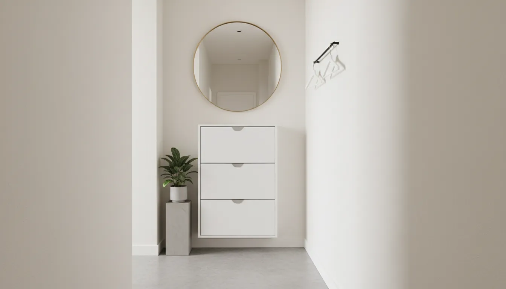
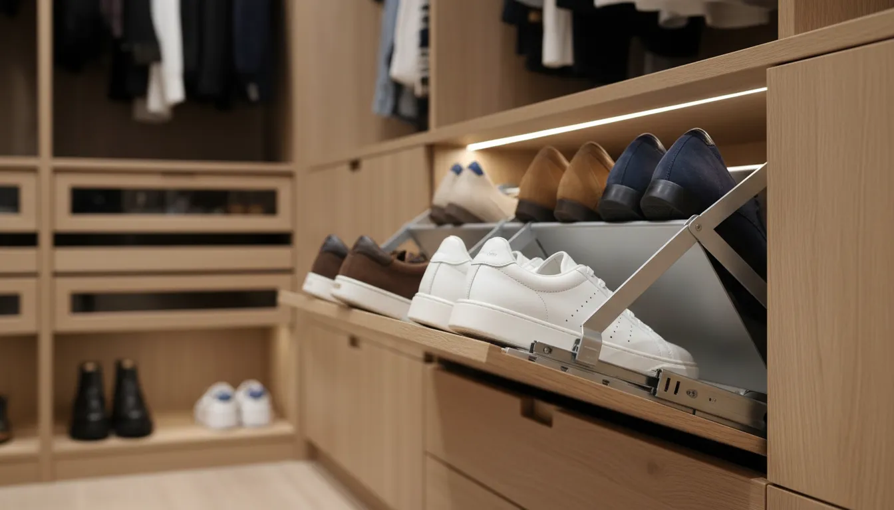
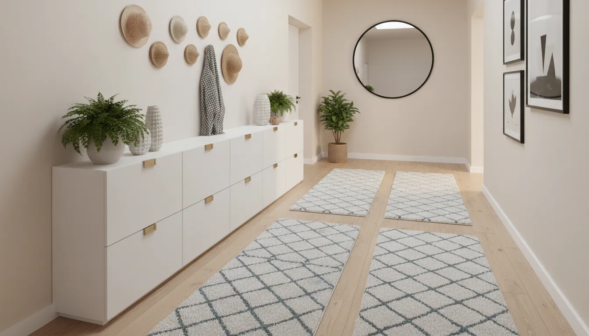

# The Ultimate Guide to Slim Shoe Storage Cabinets for Hallways

The hallway is the artery of the home. It is the first space that greets you upon arrival and the last you see before departing. Despite its pivotal role in setting the tone for the rest of the house, the hallway is frequently the most neglected area in terms of design and functionality. For many homeowners and apartment dwellers, the challenge lies in the architectural reality of the corridor: it is long, narrow, and unforgiving of clutter.

The accumulation of footwear in a narrow entryway is not merely an aesthetic grievance; it is a functional obstacle. Tripping over discarded sneakers or navigating a maze of boots creates subconscious stress the moment one walks through the door. This is where the slim shoe storage cabinet emerges as an essential element of modern interior design. Unlike bulky wardrobes or open racks that encroach upon walking space, slim cabinets are engineered to hug the wall, utilizing vertical space while maintaining a minimal footprint.

This comprehensive guide will explore the mechanics, aesthetics, and practical applications of slim shoe storage cabinets. We will delve into how to select the perfect unit for your specific dimensions, how to style it to elevate your home decor, and the best practices for installation and organization.

## The Architecture of the Slim Cabinet

To understand why these units are superior for narrow spaces, one must understand their construction. Traditional shoe racks rely on horizontal depth to accommodate the length of a shoe, typically requiring 12 to 14 inches of floor space extending from the wall. In a hallway that may only be 36 inches wide, this consumes nearly half of the walkable area.

Slim shoe cabinets, conversely, utilize a "tip-out" or "drop-down" drawer mechanism. Instead of resting flat, shoes are stored vertically or at a steep angle within a pivoting compartment. This ingenious engineering allows the cabinet depth to be drastically reduced—often to as little as 6 to 10 inches. When the drawer is closed, the shoes disappear completely, leaving a sleek, flat facade that imposes minimal visual weight on the room.

### Assessing Your Spatial Requirements

Before purchasing furniture for a high-traffic zone, rigorous measurement is required. A slim cabinet is only effective if it facilitates flow rather than obstructing it.

1.  **Measure the Width:** Determine how much wall space is available. Ensure there is clearance for opening doors (both the front door and any interior doors) so they do not swing into the cabinet.
2.  **Measure the Depth:** This is the most critical metric. Open your front door fully and measure the distance between the open door slab and the wall. Your cabinet should ideally be shallower than this distance to prevent collisions.
3.  **Account for Skirting Boards:** Most walls feature baseboards or skirting. If you intend to flush-mount the cabinet against the wall, check if the unit has cut-outs for baseboards or if it has legs that provide clearance. If not, the cabinet will sit an inch away from the wall, which impacts stability.
4.  **Vertical Clearance:** Consider light switches, thermostats, or intercoms that may be located on the hallway wall. Ensure the height of the cabinet does not obstruct these utilities.

## Material Selection and Aesthetic Integration

A shoe cabinet is not merely a utility item; it is a piece of furniture that contributes to your home's design language. Because hallways often lack natural light, the material and finish of your cabinet can significantly influence the brightness and perceived size of the space.

### The Modern Minimalist (White and Gloss)

For the tightest spaces, white remains the superior choice. White reflects light, allowing the cabinet to blend visually into white walls, thereby reducing its presence. A high-gloss finish can further enhance this effect by bouncing light around the corridor.

If your goal is to make the storage disappear, look for handleless designs with push-to-open mechanisms. These units provide a clean, uninterrupted line that defines modern minimalism.

For those seeking a pristine, modern aesthetic, we recommend exploring high-quality laminate options that resist scuffs and are easy to clean.

**Recommended Product:** [Modern White Tilt-Out Shoe Cabinet](https://www.amazon.com/s?k=white+slim+shoe+cabinet+tilt+out&tag=hats0f8-20)

### The Industrial Edge (Metal)

Metal shoe cabinets have gained popularity for their durability and exceptionally thin profiles. Often constructed from powder-coated steel, these units are magnetic, easy to sanitize, and impervious to moisture—a significant benefit if you frequently store wet shoes.

 aesthetically, they suit industrial, loft-style, or contemporary homes. They often come in matte black, anthracite, or white. The metal construction allows for thinner walls compared to wood, potentially offering a fraction more internal storage space for the same external dimensions.

**Recommended Product:** [Industrial Metal Tipping Shoe Cabinet](https://www.amazon.com/s?k=metal+tipping+shoe+cabinet+black&tag=hats0f8-20)

### The Warmth of Wood (Timber and Veneer)

To counter the "tunnel effect" of a long hallway, introducing natural textures is vital. A slim cabinet in oak, walnut, or pine adds warmth and character. Solid wood options are heavier and more expensive but offer longevity. Engineered wood with high-quality veneers offers a cost-effective middle ground that resists warping.

When choosing wood, consider the existing flooring. It is generally advisable to select a wood tone that contrasts slightly with the floor—for example, a walnut cabinet on light oak flooring—to ground the furniture piece.

**Recommended Product:** [Natural Wood Entryway Shoe Storage](https://www.amazon.com/s?k=wooden+entryway+shoe+storage+slim&tag=hats0f8-20)

## Installation: Safety and Stability

A common oversight when installing slim shoe cabinets is failing to secure them properly. Because these units are tall, shallow, and front-heavy when the drawers are opened, they are inherently unstable. When filled with shoes, the center of gravity shifts forward.

**It is mandatory to anchor slim shoe cabinets to the wall.**

Most reputable manufacturers include anti-tip hardware. However, for maximum safety, especially in homes with children or pets, upgrade to heavy-duty toggle bolts (if anchoring to drywall) or screw directly into the wall studs. This ensures that the unit remains rigid when you pull open a drawer loaded with heavy boots.

If your hallway has thick baseboards, you may need to use a wooden batten to bridge the gap between the cabinet back and the wall, ensuring the screws have a solid purchase without bending the cabinet frame.

## Maximizing Internal Storage Capacity

The "slim" nature of these cabinets imposes certain limitations on capacity. A standard unit might hold between 8 to 12 pairs of shoes. However, strategic organization can increase this yield.

### The Art of Shoe Tetris

To maximize space, consider the orientation of your footwear.
*   **Interlocking:** Place one shoe facing toe-forward and its pair facing heel-forward. This nesting technique often reduces the width required for each pair.
*   **High-tops and Ankle Boots:** These often struggle to fit in standard tip-out drawers. If your cabinet has adjustable dividers (removable slats inside the drawer), remove them to create a single deep compartment rather than two shallow ones. This accommodates taller footwear.
*   **Vertical Stacking:** For flat sandals and flip-flops, avoid laying them flat. Stand them vertically against the drawer divider to fit three or four pairs in the space of one.

### Handling Oversized Footwear

It is important to manage expectations: slim cabinets are rarely designed for knee-high boots or heavy-duty hiking gear. Attempting to force these items into the mechanism can damage the hinges.

We recommend designating the slim cabinet for "everyday" shoes—sneakers, loafers, flats, and pumps. For larger items, consider a small, dedicated boot tray or explore [hidden storage benches](/posts/hidden-storage-benches-for-small-spaces) that can complement your slim cabinet without overcrowding the hall.

## Styling the Hallway Console

One of the greatest secondary benefits of a slim shoe cabinet is the surface it provides. At waist height, the top of the cabinet functions as a console table, offering a prime opportunity for entryway styling.

This surface is the "landing strip" for your home. It needs to be functional yet curated.

1.  **The "Drop Zone" Tray:** Place a small, stylish tray (leather, marble, or brass) on one side of the cabinet. This is the designated spot for keys, wallets, and sunglasses. Containing these small items prevents the surface from looking cluttered.
2.  **Lighting:** A narrow table lamp adds vertical interest and ambient lighting, which is far more welcoming than harsh overhead hallway lights. If you lack a power outlet nearby, consider rechargeable LED lamps or battery-operated sconces above the unit.
3.  **The Mirror Trick:** Hanging a large mirror directly above the shoe cabinet is a classic interior design trick. It allows you to check your appearance before leaving, reflects light to brighten the hallway, and visually doubles the depth of the space.
4.  **Greenery:** A tall vase with dried branches or a small potted succulent adds life to the space without requiring significant depth.

For more in-depth styling advice, you might find our guide on [styling narrow entryways](/posts/styling-narrow-entryways) particularly useful for coordinating decor elements.

## Maintenance and Longevity

High-traffic areas endure significant wear and tear. To keep your cabinet looking pristine:

*   **Odor Control:** Shoe cabinets can trap odors. Place small sachets of activated charcoal or cedar balls inside each compartment. These absorb moisture and neutralize smells naturally.
*   **Hinge Care:** The pivot mechanism is the only moving part. Once a year, check that the screws tightening the hinge to the drawer face are secure, as the vibration of opening and closing can loosen them over time.
*   **Surface Protection:** If you use the top surface for keys, consider adding a runner or a glass top to prevent scratches on wood or painted finishes.

## Conclusion: Order from Chaos

The transition from the outside world into your sanctuary should be seamless. A hallway cluttered with footwear creates a barrier to relaxation the moment you step inside. The slim shoe storage cabinet is more than a piece of furniture; it is a tool for mental clarity and spatial efficiency.

By selecting a unit that respects the dimensions of your corridor, anchoring it safely, and styling it to reflect your personal taste, you transform a chaotic thoroughfare into a sophisticated entryway. Whether you opt for a sleek metal unit or a warm wooden finish, the result is the same: a home that welcomes you with open space rather than obstacles.

Take the time to measure your space today. Visualizing the potential of your hallway is the first step toward a more organized, serene home environment.