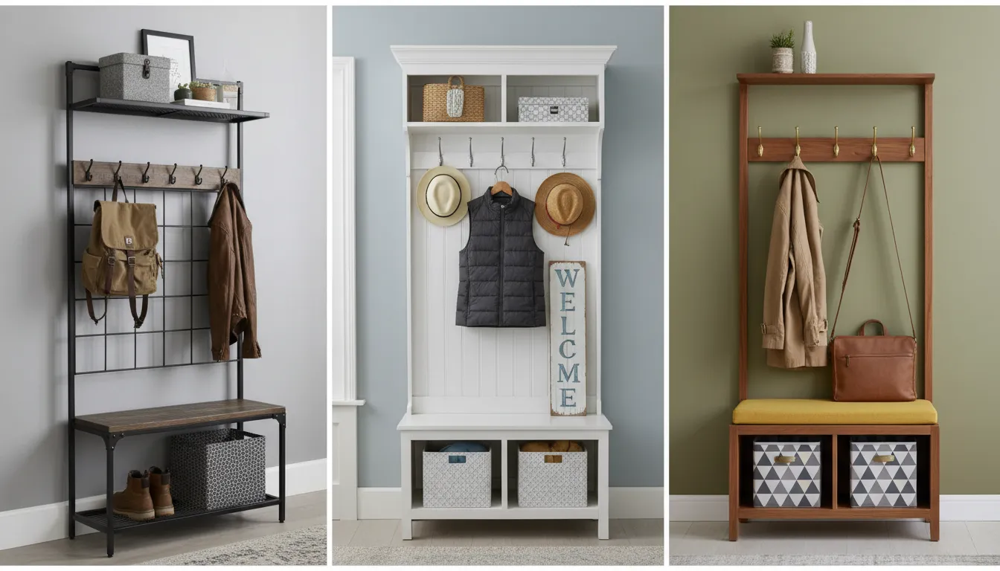
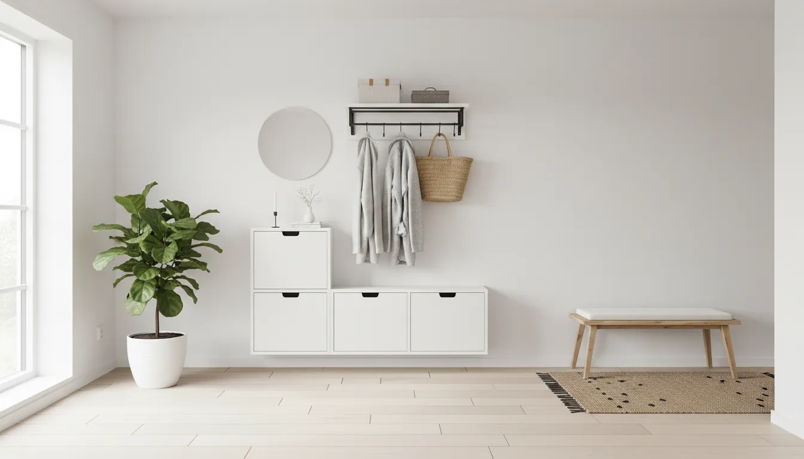
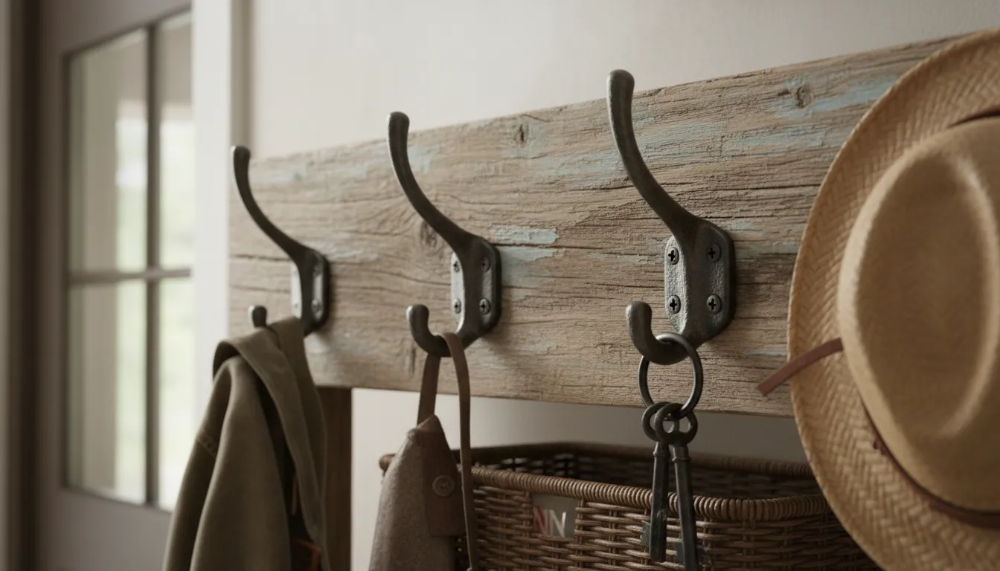

# Top 5 Retailers for Affordable Hall Trees and Entryway Storage Units

The entryway is the handshake of your home. It is the first thing guests see when they arrive and the last thing you see when you leave. Yet, for many of us, this critical space often becomes a chaotic dumping ground for backpacks, muddy boots, wayward umbrellas, and piles of mail. The solution, inevitably, is better organization. However, a quick search for high-end furniture might leave you believing that an organized foyer requires a second mortgage.

Fortunately, you do not need to spend thousands on custom joinery to achieve a polished look. The market for **affordable hall trees** and versatile **entryway storage units** has exploded in recent years, offering stylish, durable, and functional pieces at price points that won't break the bank. Whether you are outfitting a tiny apartment vestibule or a sprawling suburban mudroom, finding the right retailer is half the battle.

In this comprehensive guide, we will explore the top five retailers that consistently deliver high value, great style, and durability for budget-conscious shoppers. We will analyze their offerings, pros and cons, and help you navigate the world of **cheap entryway furniture** without sacrificing quality.

## The Rise of Budget-Friendly Entryway Design

Before we dive into the specific retailers, it is important to understand why the market has shifted. Historically, a "hall tree" was a heavy, solid wood antique. Today, manufacturing advancements in engineered wood, sturdy metal frames, and flat-pack logistics have democratized design. You can now find a **shoe storage bench** or a multifunctional coat rack that mimics the aesthetic of industrial chic or modern farmhouse styles for a fraction of the cost of solid wood alternatives.

However, buying on a budget requires a discerning eye. You need to know where to look to avoid flimsy particle board that crumbles under the weight of a heavy winter coat. The retailers listed below have been selected based on their reputation for customer service, product variety, and the balance between cost and quality.

## 1. Wayfair: The King of Variety

When it comes to online furniture shopping, Wayfair is the juggernaut that cannot be ignored. For anyone seeking **affordable hall trees**, Wayfair offers an inventory that is virtually unmatched in scope. Their search filters allow you to drill down by width, material, style, and—most importantly—price.

### Why Wayfair Makes the List
Wayfair specializes in "looks for less." If you see a gorgeous, expensive mudroom setup on Pinterest, chances are you can find a convincing dupe on Wayfair. Their proprietary brands, such as *Three Posts* (for traditional/farmhouse styles) and *17 Stories* (for industrial styles), offer consistent quality at entry-level prices.

### What to Look For
*   **The "Open Box" Deals:** For the ultra-budget conscious, Wayfair’s Open Box section offers steep discounts on returned items. Since hall trees are often large items, returns are expensive for the company to process, so they mark them down significantly.
*   **Customer Photos:** Never buy based solely on the stock photo. Wayfair has a robust review system where users upload real-life pictures. This is crucial for seeing how the wood finish actually looks in normal lighting.
*   **Flash Sales:** Keep an eye out for "Way Day" or holiday sales, where **entryway storage units** can drop by an additional 20-30%.

**Pros:**
*   Massive selection of styles (Farmhouse, Industrial, Coastal, Modern).
*   Frequent sales and free shipping on most furniture items.
*   Detailed specifications regarding weight capacity per hook.

**Cons:**
*   Assembly is almost always required and can be complex.
*   Return shipping costs can be high if the item isn't defective.

## 2. Amazon: Convenience Meets Competitive Pricing

Amazon is likely already your go-to for household staples, but it is also a powerhouse for **cheap entryway furniture**. The competitive nature of the Amazon marketplace drives prices down, making it one of the **best places to buy hall trees** if you are strictly watching your bottom line.

### Navigating the Amazon Marketplace
Amazon shines when looking for hybrid metal-and-wood units. These are generally easier to ship and assemble than full wooden units. Brands like VASAGLE and HOOBRO have dominated this niche, offering sturdy metal frames with particle board accents that look surprisingly high-end.

If you are looking for a versatile solution that combines seating with storage, checking Amazon's selection is a must. You can often find a hall tree that integrates a bench and shoe racks all in one.

If you are ready to browse some of the most popular options available right now, check out this search for highly-rated hall trees with integrated benches:
[**Shop Hall Trees with Benches on Amazon**](https://www.amazon.com/s?k=hall+tree+with+bench&tag=hats0f8-20)

### Key Considerations for Amazon Shoppers
*   **Prime Shipping:** The biggest advantage is speed. If you decide on a Tuesday that you need to organize your foyer by Saturday, Amazon is your best bet.
*   **Review Analysis:** Use tools or your own judgment to scan reviews. Look for comments specifically mentioning "wobble" or "assembly instructions." A 4-star item with difficult instructions is better than a 5-star item with fake reviews.
*   **Dimensions:** Pay close attention to the dimensions listed in the product description images. Amazon product titles often use buzzwords like "large" or "tall" loosely.

**Pros:**
*   Fastest shipping speeds.
*   Extremely competitive pricing on industrial-style units.
*   Easy returns (especially if you can drop off at a local partner location).

**Cons:**
*   Quality can vary significantly between third-party sellers.
*   Less variety in "solid wood" looks compared to dedicated furniture stores.

## 3. IKEA: The Scandinavian Standard

No list of affordable furniture is complete without IKEA. For **entryway storage units**, IKEA offers a clean, minimalist aesthetic that works in almost any home. While they are known for flat-pack furniture, their designs are often more thoughtful regarding small-space living than their competitors.

### The Best Series for Entryways
*   **HEMNES:** This series uses solid pine for many components, which is a massive step up from the particle board found elsewhere, yet remains affordable. The Hemnes open wardrobe and storage bench are classics.
*   **PINNIG:** If you prefer the metal aesthetic, the Pinnig line offers a coat rack with a shoe storage bench that is practically indestructible and very affordable.
*   **MACKAPÄR:** Designed specifically for tight spaces, this line features sliding doors and clever **entryway organization hacks** built into the design.

### The "IKEA Hack" Potential
One of the biggest reasons to choose IKEA is the ability to customize. A standard IKEA hall tree can be painted, outfitted with new hardware, or built into a legitimate mudroom wall with a little trim and caulk. If you are interested in DIY, you might want to read our guide on [Transforming Basic Shelves into Built-ins](/posts/transforming-basic-shelves-into-built-ins) to see how you can elevate these budget pieces.

**Pros:**
*   Consistent aesthetic that mixes and matches well.
*   Modular systems allow you to expand storage as needed.
*   Higher use of solid wood (pine) in certain lines compared to competitors.

**Cons:**
*   Stock availability can be spotty.
*   Shipping costs can be high if you don't live near a store.
*   Assembly is mandatory and iconic for being a relationship test.

## 4. Walmart: Accessible and Surprisingly Stylish

If you haven't looked at Walmart's furniture section in the last five years, you are missing out. They have aggressively revamped their home goods lines, partnering with magazines and celebrities to create exclusive collections that rival West Elm or Pottery Barn in looks, but at Walmart prices.

### Brands to Watch
*   **Better Homes & Gardens:** This is the gold standard for Walmart furniture. Their cube organizers are legendary, but their hall trees and **budget coat racks** are equally impressive. They often feature thicker boards and better hardware than generic brands.
*   **Mainstays:** For the absolute tightest budgets, Mainstays offers functional items. While they may not be heirloom quality, they serve the purpose for dorms or first apartments perfectly.

### The "Site-to-Store" Advantage
Walmart's logistics network allows you to order heavy furniture online and have it shipped to your local store for free pickup. This eliminates the risk of porch pirates and saves on shipping fees for heavy entryway units.

If you are looking for a standalone piece to complement a hall tree, such as a dedicated storage bench for the opposite wall, Walmart (and similar marketplaces) offer excellent modern options.
[**Find Modern Entryway Storage Benches**](https://www.amazon.com/s?k=entryway+storage+bench+modern&tag=hats0f8-20)

**Pros:**
*   The *Better Homes & Gardens* line offers exceptional value for money.
*   Free pickup options save on shipping.
*   Easy returns in-store.

**Cons:**
*   In-store stock is usually limited; the best items are online-only.
*   Durability on the lowest-tier (Mainstays) items can be lacking for heavy daily use.

## 5. Target: Trendy and Functional

Target strikes a balance between the mass-market appeal of Walmart and the style-consciousness of West Elm. Their furniture brands, specifically *Threshold* and *Project 62*, are designed to be showcased. If you want your **affordable hall trees** to look like a purposeful design choice rather than just a utility item, Target is a strong contender.

### Design-Forward Storage
Target excels at small-scale furniture. If you have a narrow hallway rather than a grand foyer, Target’s selection of leaning coat racks and slim **shoe storage bench** options is superior. They often incorporate trending materials like rattan, cane, and matte black metal before other budget retailers do.

### Target Circle and RedCard
Using the Target app and RedCard can save you an automatic 5% and get you free shipping. On a $200 hall tree, that $10 saving covers your morning coffee run. Furthermore, Target's return policy is generally very generous, allowing you to return items by mail or in-store if they don't fit your space.

**Pros:**
*   On-trend designs that look more expensive than they are.
*   Good selection for small apartments and narrow entryways.
*   Easy assembly compared to some other flat-pack brands.

**Cons:**
*   Prices can be slightly higher than Walmart or Amazon.
*   Popular items sell out very quickly.

## Key Features to Look for in Budget Hall Trees

Regardless of which retailer you choose, knowing what to look for ensures you don't end up with a wobbly mess. When shopping for **cheap entryway furniture**, keep these three factors in mind:

### 1. Material Durability: MDF vs. Metal vs. Wood
At a lower price point, you will rarely find solid oak or mahogany. Most affordable units are made of MDF (Medium Density Fiberboard) or Particle Board with a laminate finish.
*   **MDF:** Heavier and smoother than particle board. It paints well but swells if it gets wet (beware of snowy boots!).
*   **Metal Frames:** often the strongest option for budget buyers. A metal frame with wood shelves offers rigidity that cheap all-wood units often lack.

### 2. Weight Capacity
Always check the weight limit, specifically for the bench and the hooks. A **budget coat rack** might look nice, but if the hooks are rated for 5 lbs and your winter coat weighs 8 lbs, you will have a problem. Look for hooks that are bolted through the board, not just screwed into the surface.

### 3. Storage Configuration
Do you need to hide mess or display decor?
*   **Cubbies:** Great for shoes, but can look cluttered if not organized.
*   **Flip-top Benches:** Excellent for hiding scarves and bags, but difficult to access if you keep pillows on top.
*   **Cabinets:** The ultimate for hiding clutter.

If your hall tree doesn't have enough enclosed storage, consider adding a dedicated shoe cabinet nearby to keep the visual clutter down.
[**Browse High-Rated Shoe Storage Cabinets**](https://www.amazon.com/s?k=shoe+storage+cabinet+entryway&tag=hats0f8-20)

## DIY vs. Buying Affordable: What’s Best?

Is it better to buy a $200 hall tree from Wayfair or build one yourself?
*   **Buy if:** You lack tools, time, or a dedicated workspace. The finish on manufactured furniture (even cheap furniture) is usually more durable against scratches than a DIY paint job unless you are an expert.
*   **DIY if:** You have a weirdly shaped alcove. Retailers sell standard sizes. If you have a specific nook that is 43.5 inches wide, a 40-inch unit will leave awkward gaps.

For those leaning toward a custom look without the custom work, consider buying a budget unit and upgrading the hardware. Swapping out generic silver hooks for matte black or antique brass can instantly make a Walmart piece look like a boutique find.

## Maintenance Tips for Low-Cost Furniture

To make your **entryway storage units** last longer:
1.  **Use Wood Glue:** During assembly, add a drop of wood glue to dowels and joints. This significantly increases the rigidity of flat-pack furniture.
2.  **Anchor it:** Affordable units are often lighter. Always anchor the hall tree to the wall to prevent tipping, especially if you have children.
3.  **Protect from Moisture:** If you buy a particle board unit, use a plastic tray for wet shoes. Water is the enemy of budget furniture.

## Conclusion

Creating an organized, welcoming entry does not require a luxury budget. By shopping strategically at retailers like Wayfair, Amazon, IKEA, Walmart, and Target, you can find **affordable hall trees** that solve your clutter problems while enhancing your home's style.

Remember to measure your space twice, read the reviews regarding assembly, and look for materials that suit your lifestyle. Whether you choose the industrial speed of Amazon, the hacking potential of IKEA, or the trend-setting styles of Target, the perfect **entryway organization hacks** are within your reach.

Ready to organize the rest of your home? Check out our guide on [Small Closet Solutions](/posts/small-closet-solutions-for-studio-apartments) to keep the momentum going. Happy shopping and organizing!