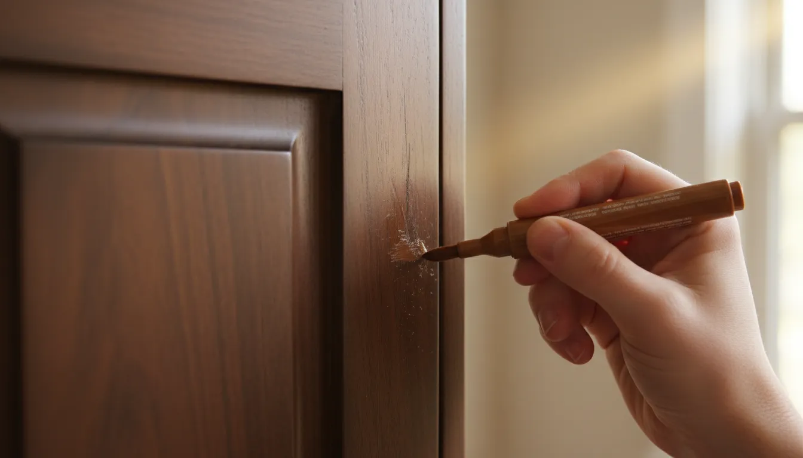

n
---
title: "Troubleshooting Common Hall Tree Issues: Loose Hooks, Squeaky Benches, and More"
slug: "troubleshooting-common-hall-tree-issues-loose-hooks-squeaky-benches-and-more"
pubDate: "2026-01-28"
description: "Is your entryway furniture showing signs of wear? Learn how to fix loose hooks, silence squeaky benches, and repair common hall tree damage with our expert guide."
author: "linda wise"
image:
  url: "../../images/blog/troubleshooting-common-hall-tree-issues-loose-hooks-squeaky-benches-and-more.webp"
  alt: "A photo of a well-used wooden hall tree in a bright entryway, highlighting a tool kit resting on the storage bench ready for repairs."
tags: 
  - DIY Repair
  - Entryway Organization
  - Furniture Maintenance
  - Home Improvement
category: "Maintenance & Repair"
keywords:
  - hall tree repair
  - loose coat hooks
  - fix squeaky furniture
  - entryway storage maintenance
  - hall tree assembly
  - wood furniture care
  - DIY furniture fix
canonical: "https://www.entrywaystorage.com/posts/troubleshooting-common-hall-tree-issues-loose-hooks-squeaky-benches-and-more"
---

# Troubleshooting Common Hall Tree Issues: Loose Hooks, Squeaky Benches, and More

Your hall tree is arguably the hardest-working piece of furniture in your home. It stands guard at the entryway, greeting you after a long day, and immediately takes the burden of heavy winter coats, mud-caked boots, wet umbrellas, and overstuffed backpacks. Unlike a decorative side table that holds a single lamp, a hall tree is a functional beast of burden. However, this constant daily use inevitably leads to wear and tear.

Over time, you might notice that the coat hooks droop under the weight of your jackets, the storage bench groans in protest when you sit down to tie your shoes, or the entire structure feels a little less stable than it did on day one. Before you consider dragging your beloved entryway organizer to the curb, take a breath. Most **hall tree repair** tasks are surprisingly simple and can be accomplished with a few basic tools and a free afternoon.

In this comprehensive guide, we will troubleshoot the most annoying mechanical and cosmetic issues that plague entryway storage units. From reinforcing stripped screws to silencing the dreaded "creak," we will cover everything you need to know to restore your furniture to its former glory.

## The Most Common Culprit: Fixing Loose Coat Hooks

If there is one issue that every hall tree owner faces eventually, it is the wobbly coat hook. It starts as a slight wiggle and eventually turns into a hook that hangs upside down, unable to hold even a light scarf. This usually happens because the screws holding the hook have stripped the wood hole, making it too wide for the threads to grip.

This issue is particularly prevalent in furniture made from MDF (Medium Density Fiberboard) or particleboard, which does not hold screws as tightly as solid wood over time. Here is a step-by-step breakdown on how to fix this **entryway storage maintenance** headache.

### Method 1: The Toothpick and Glue Trick
This is a classic **DIY furniture fix** that costs pennies but offers a surprisingly durable result.

1.  **Remove the Hook:** Unscrew the loose hook completely and set the hardware aside.
2.  **Clean the Hole:** Use a vacuum or a blast of compressed air to remove any sawdust or loose debris from the screw hole.
3.  **Prepare the Filler:** Take a standard wooden toothpick (or several, depending on the size of the hole) and dip it into wood glue.
4.  **Insert and Break:** Insert the glue-coated toothpick into the stripped hole. Tap it in gently with a hammer if necessary. Break off the excess wood so it is flush with the surface of the hall tree.
5.  **Dry and Rescrew:** Allow the glue to dry for at least an hour. Once hardened, you have created new wood for the screw to bite into. Drive the screw back in; it should hold tight.

### Method 2: Using Screw Anchors or larger Screws
If the hole is significantly damaged, toothpicks might not cut it.

*   **Step Up the Size:** Try using a screw that is slightly wider (not longer) than the original. The wider threads will cut into fresh wood.
*   **Plastic Anchors:** For hollow-core doors or very soft particle board, you can drill the hole slightly larger and insert a small drywall anchor, then screw the hook into the anchor.

### Method 3: Wood Filler for severe damage
For holes that have become jagged or overly large, a hardening wood filler is your best bet.

1.  Fill the hole completely with a high-quality two-part wood filler.
2.  Smooth it over with a putty knife.
3.  Let it cure according to the package instructions.
4.  Drill a new pilot hole smaller than your screw diameter.
5.  Reattach the hook.

If you are dealing with multiple loose connections or stripped holes across your unit, having a comprehensive repair kit is essential.

**Recommended Product:**
To handle these repairs effectively, I highly recommend keeping a dedicated wood repair kit on hand.
[**Katzco Furniture Repair Kit Wood Markers**](https://www.amazon.com/s?k=wood+filler+furniture+repair+kit&tag=hats0f8-20)
*This kit often includes fillers and markers, making it perfect for both structural hole filling and cosmetic touch-ups.*

## Silencing the Squeak: Troubleshooting Bench Noises

There is nothing quite as jarring as a loud *SCREEEAK* when you sit down to put on your boots in the morning. **Fixing squeaky furniture** requires a bit of detective work because the noise can come from several different sources. Generally, a squeak is the sound of friction—two parts rubbing together that shouldn't be, or parts rubbing together without lubrication.

### Identifying the Source
To fix the squeak, you must find it.
*   **The Joints:** The most common cause. As wood expands and contracts with humidity, bolts loosen. Loose joints allow movement, creating noise.
*   **The Lid (If applicable):** If you have a lift-top bench, the hinges are a prime suspect.
*   **The Floor:** Sometimes the hall tree isn't squeaking; it's rubbing against an uneven floorboard.

### Tightening and Gluing
If the sound comes from the frame:
1.  **Locate all fasteners:** Go through the entire assembly, focusing on the bench area.
2.  **Tighten, but don't over-tighten:** Use an Allen wrench or screwdriver to snug up every bolt. **Warning:** If you have an MDF hall tree, over-tightening can crack the laminate or strip the internal cam locks. Stop as soon as you feel firm resistance.
3.  **Glue the Joints:** If a joint is persistently loose and squeaky, disassemble it, apply a bead of wood glue to the dowels or mating surfaces, and reassemble. Clamp it until dry. This fuses the pieces, eliminating the movement that causes squeaks.

### Lubricating Hinges and Metal Parts
If the noise is metallic or coming from a lift-top lid:
*   **Spray Lubricant:** Use a silicone-based lubricant on the hinge pins. Avoid oil-based products like WD-40 for long-term lubrication, as they can attract dust and eventually get gummy.
*   **Wax:** For wood-on-wood friction (like a lid rubbing against the frame), rub a little candle wax or beeswax along the contact points.

**Recommended Product:**
For maintaining the wood and reducing friction between moving wooden parts, a high-quality beeswax polish is invaluable.
[**Howard Feed-N-Wax Wood Polish and Conditioner**](https://www.amazon.com/s?k=beeswax+furniture+polish&tag=hats0f8-20)
*This product not only lubricates to stop squeaks but also restores the luster of the wood finish.*

## Stabilizing a Wobbly Hall Tree

A wobbly hall tree is annoying, but it is also a safety hazard. Because these units are tall and often top-heavy (especially when loaded with coats), instability can lead to tipping.

### Leveling the Unit
Most wobbles are caused by uneven flooring rather than a defect in the furniture.
*   **Check the Feet:** Many modern hall trees come with adjustable leveling feet. These are small screw-in pads on the bottom of the legs. Turn them clockwise or counter-clockwise to raise or lower each corner until the unit sits flat without rocking.
*   **Use Shims:** If your unit has flat legs, use furniture shims (small wedges of wood or plastic). Slide a shim under the leg that is not touching the floor until the unit is stable. Snap off the excess shim so it isn't visible.

### Structural Racking
If the unit wobbles because the frame itself is loose (parallelogramming), you need to square it up.
1.  Push the unit so it looks square.
2.  Install metal L-brackets (corner braces) on the back corners where they won't be seen. This rigid connection prevents the **hall tree assembly** from shifting side-to-side.

### The Importance of Anchoring
We cannot stress this enough: **You must anchor your hall tree.** Even a stable unit can tip if a child climbs on the bench or pulls on a heavy coat. For more details on this specific safety step, check out our guide on [how to secure your hall tree to the wall](/posts/how-to-secure-your-hall-tree-to-the-wall).

## Cosmetic Repairs: Scratches, Dents, and Chips

Your entryway is a high-traffic zone. Keys get tossed onto the shelf, dog leashes scrape the sides, and wet bags leave water rings. Cosmetic damage is inevitable, but **wood furniture care** doesn't have to be difficult.

### Fixing Scratches
*   **Light Scratches:** For minor surface scratches in the clear coat, a mixture of olive oil and vinegar (1:1 ratio) can sometimes hide the mark. Alternatively, rubbing a walnut meat (yes, the actual nut) over the scratch can deposit natural oils that darken the wood.
*   **Deep Scratches:** For scratches that penetrate the color, use a furniture repair marker. Start with a lighter shade and layer it until you match the finish.
*   **Gouges:** If a chunk of wood is missing, use a wax filler stick. Rub the stick over the gouge until it is filled, then buff it smooth with a credit card or plastic scraper.

### Treating Water Damage
If wet boots or umbrellas have left white rings on your wooden bench:
1.  **Heat Method:** Place a dry cotton cloth over the stain and run a warm (no steam) iron over it for a few seconds. This draws the trapped moisture out of the finish.
2.  **Oil Method:** If the finish is dry and cracking, massage a restorative oil into the wood to rehydrate it.

**Recommended Product:**
To keep cosmetic damages at bay and hide the ones that already exist, a furniture marker set is essential for any homeowner.
[**Rejuvenate Wood Furniture & Floor Repair Markers**](https://www.amazon.com/s?k=furniture+repair+markers+wood+touch+up&tag=hats0f8-20)
*This set allows you to blend colors to match your specific hall tree finish perfectly.*

## Adjusting Misaligned Doors and Drawers

If your hall tree features storage cabinets or drawers, you may find that over time, the doors start to sag or the drawers stick. This is rarely a sign of broken furniture; it is usually just hardware that needs calibration.

### Drawer Slide Troubleshooting
*   **Sticking Drawers:** Remove the drawer and inspect the metal slides. Wipe away any old, gritty grease with a rag. Apply a fresh spray of dry Teflon lubricant or silicone spray. *Do not use grease*, as it attracts dust and hair (common in entryways).
*   **Loose Fronts:** If the drawer front feels like it's coming off, check the cam locks or screws on the inside of the drawer box. Tighten them, adding a drop of wood glue to the dowels if they are separating.

### Cabinet Hinge Adjustment
Modern Euro-style hinges (concealed hinges) are adjustable in three directions.
1.  **Height:** Loosen the screws mounting the hinge to the cabinet wall to move the door up or down.
2.  **Depth:** The screw at the very back of the hinge arm adjusts how close the door sits to the cabinet face.
3.  **Side-to-Side:** The screw in the center of the hinge arm adjusts the lateral movement. Use this to fix gaps between double doors or to straighten a crooked door.

## Preventive Maintenance Checklist

The best way to avoid major **hall tree repair** projects is routine maintenance. Treat your entryway furniture like you would your car—a little attention goes a long way.

*   **Seasonal Tightening:** Once a year (perhaps when you swap your summer gear for winter coats), go around the unit with a screwdriver and check all visible fasteners.
*   **Moisture Control:** Keep a plastic tray on the bench or shelf for wet boots. Never place wet items directly on wood or MDF surfaces.
*   **Weight Management:** Be mindful of the weight limit of your hooks. If you have a heavy wool trench coat, consider hanging it on a hanger in a closet rather than stressing a single hook.
*   **Clean Regularly:** Dust and dirt act like sandpaper. Regular dusting prevents the finish from wearing down prematurely.

## When to Call a Professional vs. DIY

While most issues are solvable with **DIY furniture fix** techniques, there are times when you should call in a pro or consider a replacement:
*   **Structural Cracks:** If a main load-bearing leg is cracked through, glue might not be enough to ensure safety.
*   **Severe Water Damage:** If particleboard has swollen and crumbled like a wet biscuit, it cannot be repaired. It must be replaced.
*   **Metal Fatigue:** If the metal frame of an industrial-style hall tree has bent or a weld has snapped, you will need a metalworker or a replacement part.

If your unit is beyond repair, you might want to look into upgrading. We have an excellent guide on choosing the [best hall trees with storage benches](/posts/best-hall-trees-with-storage-benches) that can help you find a more durable replacement.

## Conclusion

Your hall tree is the anchor of your entryway. It organizes your chaos and simplifies your departures and arrivals. By addressing issues like **loose coat hooks**, squeaky joints, and surface scratches early, you extend the life of your furniture and keep your home looking polished.

Don't let a wobbly leg or a drooping hook frustrate you every time you walk in the door. Grab your screwdriver, some wood glue, and a little patience. With the troubleshooting tips outlined above, you can restore functionality and stability to your entryway storage in no time.

Remember, a well-maintained hall tree isn't just about aesthetics; it's about ensuring your home runs smoothly, one coat and shoe at a time.