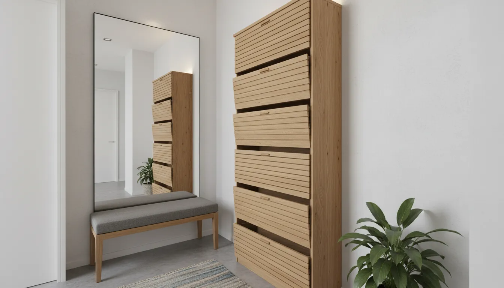
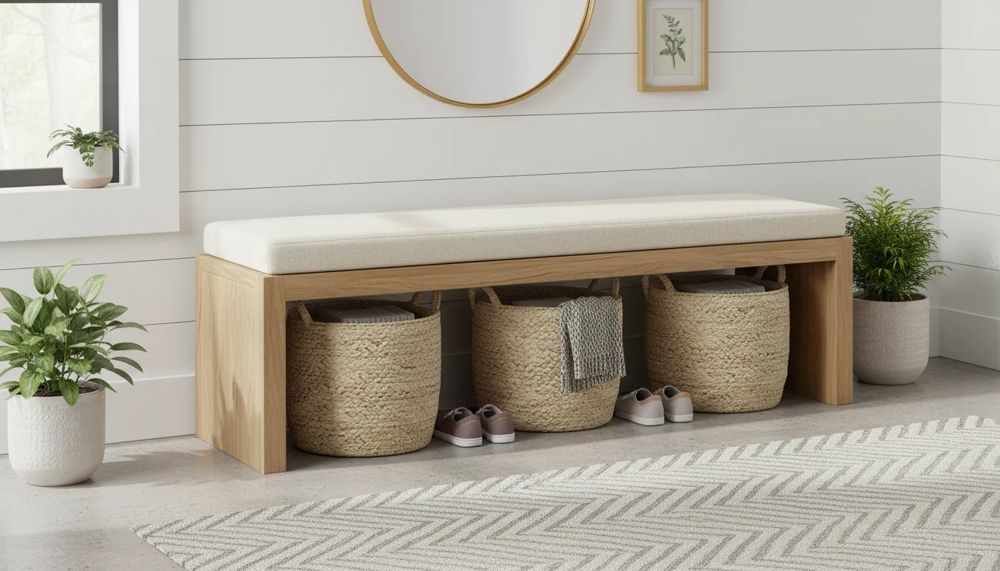
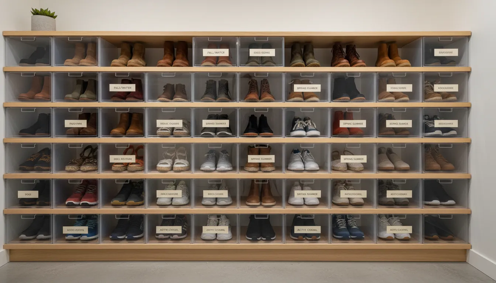

# Troubleshooting Common Shoe Storage Mistakes in Your Entryway

The entryway serves as the handshake of the home. It is the first space guests encounter and the final checkpoint before you step out into the world. Despite its importance, the entryway is frequently the most neglected area regarding organizational strategy. Specifically, shoe storage presents a unique challenge that combines volume, hygiene, and aesthetics. When managed poorly, a pile of footwear becomes a tripping hazard and a visual stressor. When managed well, it sets a tone of calm and order for the rest of the house.

Many homeowners find themselves in a cycle of organizing and reorganizing their foyers, only to find the clutter returning within a week. This recidivism usually stems not from a lack of effort, but from fundamental errors in storage strategy. By identifying and troubleshooting these common mistakes, you can build a system that is resilient, functional, and visually appealing.

In this comprehensive guide, we will dismantle the most frequent shoe storage errors and provide actionable, sophisticated solutions to rectify them.

## The Assessment Phase: Why Systems Fail

Before purchasing furniture or installing shelves, it is crucial to understand why your current setup is failing. Most storage mistakes are rooted in a misalignment between the design of the space and the behavior of its inhabitants.

If you have a family of four who all play sports, a delicate, minimalist two-tier rack will inevitably fail. Conversely, if you live in a narrow apartment, a bulky cabinet might impede traffic flow. The first step in troubleshooting is an honest audit of your footwear inventory and your household’s daily habits. Without this foundational understanding, any solution you implement will be merely cosmetic and temporary.

## Mistake 1: Ignoring the Vertical Potential

The most pervasive error in entryway organization is a fixation on floor space. Homeowners often view the floor as the only viable surface for shoes, leading to the dreaded "shoe sprawling" effect. This consumes valuable square footage and makes the entryway feel cramped and chaotic.

In narrow hallways or compact foyers, the floor is premium real estate. Allowing shoes to occupy this space limits maneuverability and creates a visual anchor that drags the eye downward, making the room feel smaller.

### The Solution: Go High and Shallow

The correction for this mistake is to shift your perspective upward. Utilizing vertical wall space is the most efficient way to multiply your storage capacity without encroaching on the walkway.

Invest in tall, slender cabinets that utilize a tipping bucket mechanism. These units are typically shallow—often less than 12 inches deep—allowing them to fit behind doors or in tight corridors where traditional shelving would be obstructive. By stacking storage vertically, you can accommodate three times the number of shoes in the same footprint.

For those with high ceilings, consider floor-to-ceiling built-ins or shelving units. Reserve the higher shelves for off-season footwear or special occasion shoes that are rarely worn, keeping daily drivers at waist height for accessibility.

If you are struggling to find a unit that balances height with a slim profile, look for specialized vertical organizers designed for tight architectural constraints.

[Browse tall narrow shoe cabinets on Amazon](https://www.amazon.com/s?k=tall+narrow+shoe+cabinet&tag=hats0f8-20)

## Mistake 2: One-Size-Fits-All Shelving

Another significant pitfall is assuming that all footwear requires the same storage dimensions. Standard shoe racks are often designed with uniform height and depth, optimized for low-top sneakers or dress shoes. This uniformity is the enemy of a diverse wardrobe.

When you attempt to force tall winter boots, high-top sneakers, or stiletto heels into a standard shelf, the system breaks down. Boots flop over, creating a messy appearance and potentially damaging the leather structure. High heels may slip through wire racks or not fit upright at all. Consequently, these items end up on the floor next to the rack, defeating the purpose of the storage unit.

### The Solution: Adjustable and Specialized Compartments

Troubleshooting this issue requires customization. When selecting storage furniture, prioritize units with adjustable shelving. This allows you to create specific zones: taller gaps for boots at the bottom and narrower gaps for flats and sandals at the top.

For tall boots, consider using boot shapers or hanging clips to maintain their verticality. If you are building custom joinery or modifying an existing closet, ensure you measure your tallest boots and deepest hiking shoes before setting the shelf heights.

For an immediate fix, look for modular storage benches or cabinets that allow you to remove or reposition dividers. This flexibility ensures that your storage evolves with your wardrobe and the changing seasons.

## Mistake 3: The "Drop Zone" Disconnect

Human behavior follows the path of least resistance. If your shoe storage system requires opening a door, pulling out a drawer, and untying laces before putting shoes away, it is likely that tired family members will simply kick their shoes off onto the mat.

This is the "Drop Zone" disconnect: the gap between where shoes *should* go and where they actually land. A system that is too fussy or difficult to access will ultimately be ignored, resulting in piles of shoes directly in front of the storage unit meant to house them.

### The Solution: Immediate Accessibility

To fix this, you must engineer a "landing strip" that accommodates immediate removal. This is particularly important for households with children or for the "daily driver" shoes that are worn multiple times a day.

An open storage bench or a designated basket system works effectively here. It bridges the gap between chaos and deep storage. The goal is to provide a containment zone that is as easy to use as the floor, but visually contained.

Baskets can be assigned to individual family members, preventing cross-contamination of clutter. A sturdy bench also encourages people to sit down to remove shoes properly, rather than kicking them off, which extends the life of the footwear.

[Find entryway storage benches with baskets on Amazon](https://www.amazon.com/s?k=entryway+storage+bench+with+baskets&tag=hats0f8-20)

## Mistake 4: Disregarding Material Durability and Moisture

Entryways are high-traffic zones exposed to the elements. Shoes bring in rain, mud, snow, road salt, and grit. A common mistake is selecting storage furniture based solely on aesthetics without considering durability.

Open wooden shelves or fabric organizers can quickly degrade when exposed to moisture and dirt. Composite woods may swell and warp if wet boots are placed directly onto them. Furthermore, placing wet shoes inside a closed cabinet without adequate ventilation creates a breeding ground for mold and unpleasant odors.

### The Solution: Waterproofing and Airflow

Troubleshoot this by integrating moisture management into your storage strategy. Always use a high-quality boot tray for wet footwear. These trays usually feature raised rims to contain melting snow or water, protecting your floors and your furniture.

Look for storage solutions made from metal, powder-coated steel, or sealed hardwoods that can withstand abrasion and moisture. If you prefer the look of a closed cabinet, ensure it has a ventilated back panel or louvered doors to allow air circulation. This prevents the buildup of humidity and keeps shoes smelling fresh.

For the floor immediately entering the home, employ a "double mat" strategy: a coarse mat outside to scrape off heavy debris, and an absorbent mat inside to trap moisture.

[Shop for waterproof boot trays on Amazon](https://www.amazon.com/s?k=waterproof+boot+tray&tag=hats0f8-20)

## Mistake 5: Visual Clutter and Open Storage

Open shelving is a popular trend in interior design, often styled perfectly in magazines with brand-new, pristine shoes. In reality, worn shoes are rarely objects of art. They are scuffed, dirty, and mismatched.

Relying entirely on open racks creates visual noise. Even if the shoes are on the rack, the array of different colors, styles, and conditions can make the entryway look cluttered and restless. This visual chaos contributes to a subconscious feeling of disorder the moment you walk through the door.

### The Solution: Concealment and Uniformity

The most effective way to elevate the aesthetic of your entryway is to conceal the shoes. Closed cabinetry, drawers, or tipping bins hide the visual complexity of footwear, presenting a clean, unified surface to the eye.

If closed storage is not an option, use uniform bins or baskets to hold the shoes on the open shelves. This reduces the visual variables; instead of seeing twenty different pairs of shoes, the eye sees four identical baskets. This technique creates a sense of rhythm and order.

When using clear plastic boxes for organization, ensure they are stackable and uniform. This is often better suited for a closet than a main entryway, but if your entryway doubles as your main storage, uniformity is key. For more tips on managing tight spaces, you might consider reading about [optimizing small closet spaces](/posts/optimizing-small-closet-spaces) to see how similar principles apply.

## Mistake 6: Neglecting Lighting and Visibility

It is difficult to maintain an organized space if you cannot see it. Entryways are often dimly lit, or the lighting is positioned in a way that casts shadows inside closets and lower shelves.

When you cannot easily find a matching pair of shoes, you are more likely to rummage, disrupting the organization of the other pairs. Dark corners in storage units also hide dirt and dust accumulation, leading to hygiene issues over time.

### The Solution: Targeted Illumination

Troubleshoot lighting issues by adding targeted illumination to your storage areas. Wireless, motion-sensor LED strips are an inexpensive and highly effective upgrade. Place them under shelves or inside cabinet doors.

When the storage area is illuminated, it becomes a focal point. Psychologically, we are more inclined to keep a well-lit stage clean than a dark corner. Good lighting also aids in color matching and inspecting shoes for needing polish or repairs before heading out.

## Mistake 7: Failing to Rotate Seasonally

A single entryway cannot—and should not—hold an entire year's worth of footwear for a whole family. Trying to squeeze flip-flops, running shoes, rain boots, and snow boots into the same limited space simultaneously guarantees overcrowding.

Overcrowding leads to damage. Shoes get crushed, zippers get stuck, and structure is lost. Furthermore, having to dig through winter boots to find summer sandals in July is an unnecessary friction in your daily routine.

### The Solution: The Seasonal Migration

Implement a strict seasonal rotation policy. The entryway should only house the shoes currently in rotation for the season. 

*   **Off-Season Storage**: Clean and store off-season footwear in labeled bins in a different location, such as a bedroom closet, under the bed, or in the basement.
*   **The Transition Period**: During transitional months (spring and autumn), allow for a slightly higher volume of shoes, but be ruthless about removing items as soon as the weather shifts definitively.

This rotation keeps the entryway inventory manageable and ensures that every pair of shoes accessible is actually relevant to the current weather conditions.

## Mistake 8: Forgetting the Guest Experience

We often design our homes strictly for our own habits, forgetting that the entryway is also a transient space for visitors. When guests arrive, the lack of designated space for their shoes often leads to an awkward pile-up near the door, blocking the exit and creating a tripping hazard.

If your storage is filled to capacity with your own shoes, a guest has no choice but to leave theirs on the floor. This makes the host appear disorganized and can make guests feel like an intrusion.

### The Solution: The "Hospitality Gap"

Always leave at least 10% of your shoe storage empty, or have a deployable solution for guests. A simple, collapsible rack that can be tucked away when not in use, or a designated empty shelf in the main cabinet, signals hospitality.

Additionally, keeping a basket of guest slippers is a thoughtful touch that encourages a shoes-off policy without making guests feel uncomfortable walking in their socks.

## Mistake 9: Overlooking Maintenance and Repair

The final mistake is not structural, but procedural. Even the best storage system will fail if the shoes themselves are bringing in excessive dirt or if the storage unit is never cleaned. Sand and grit are abrasive; over time, they act like sandpaper on the finish of your shelving and the flooring beneath it.

### The Solution: The Maintenance Protocol

Establish a routine for entryway maintenance:
1.  **Weekly**: Shake out floor mats and sweep the storage trays.
2.  **Monthly**: Wipe down the shelves with a damp cloth to remove dust and dried mud. Check for shoes that need repairs (new heels, sole glue, polishing).
3.  **Seasonally**: Deep clean the cabinet interiors when rotating stock.

Incorporating a small kit in the entryway containing a shoe brush, a lint roller, and a polishing cloth can encourage quick maintenance before the dirt accumulates.

## Conclusion: Designing for Peace of Mind

Troubleshooting shoe storage mistakes in the entryway is about more than just buying a new rack. It requires a holistic approach that considers vertical space, material science, human behavior, and aesthetics.

By shifting from floor piles to vertical cabinets, ensuring materials can handle moisture, and respecting the "drop zone" psychology, you transform a source of daily frustration into a streamlined engine of domestic efficiency.

A well-organized entryway does not just store shoes; it preserves them. It protects your floors. Most importantly, it provides a sense of arrival and departure that is uncluttered and serene. Address these common mistakes, and you will find that the chaos of the foyer is replaced by the calm of a well-oiled machine.