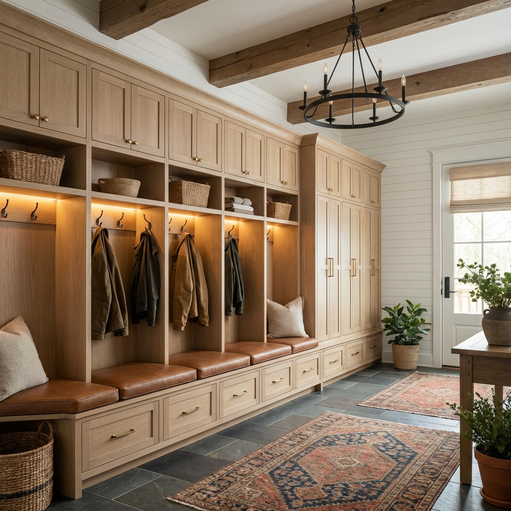
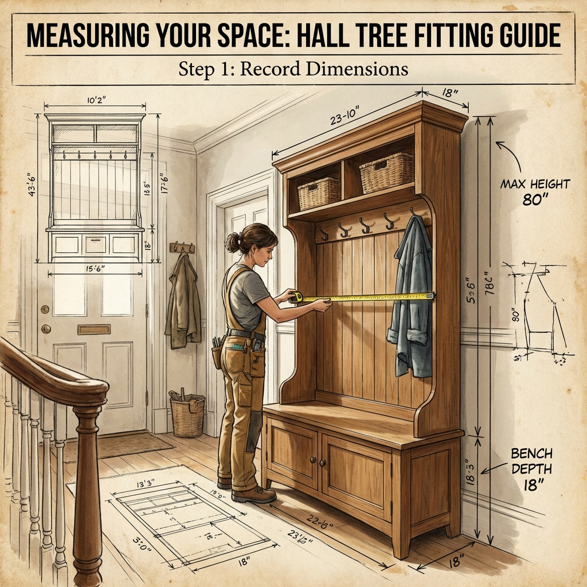

# The Ultimate Guide to Hall Trees and Mudroom Lockers

The entryway is the most hardworking room in your house. It is the transition zone between the chaos of the outside world and the sanctuary of your home. Yet, it is often the most neglected. We trip over shoes, hunt for lost keys, and bury our sofas under piles of coats because we lack a dedicated system to handle the load.

Whether you have a sprawling mudroom or a narrow apartment hallway, the solution to this chaos often lies in a single, multifunctional piece of furniture: the **Hall Tree** (or its built-in cousin, the **Mudroom Locker**).

In this comprehensive 3,000-word guide, we will connect the dots between every aspect of entryway organization. We’ve consolidated our expert articles into a single roadmap to help you plan, buy, organize, and maintain the perfect entryway system.

---

## Part 1: Understanding the Basics

### What is a Hall Tree, Exactly?
Before you start shopping, it’s crucial to understand the terminology. Is a "hall tree" just a coat rack? Is a "mudroom locker" only for schools?
*   **The Hall Tree:** Historically a Victorian invention, the modern hall tree is a freestanding unit that combines a bench, coat hooks, and shoe storage. It is mobile, renter-friendly, and perfect for "micro-mudrooms."
*   **Mudroom Lockers:** These are typically built-in cabinetry runs, often featuring individual cubbies for each family member. They offer a seamless, high-end look but require professional installation.

**Read more about the history and definitions:**
*   [Decoding Hall Tree Terminology](/blog/decoding-hall-tree-terminology)
*   [The Evolution of the Hall Tree: From Victorian Furniture to Modern Hubs](/blog/the-evolution-of-the-hall-tree_-from-victorian-furniture-to-modern-entryway-hubs)
*   [Mudroom Lockers vs. Hall Trees: Which is Right For You?](/blog/mudroom-lockers-vs-hall-trees)

### Why You Need One (Even Without a Mudroom)
The biggest myth in home organization is that you need a dedicated room to be organized. You don't. You need a **system**. A hall tree acts as a "phantom wall," defining the entryway space in an open floor plan and capturing clutter before it migrates to the living room.
*   [Why Every Home Needs a Mudroom Locker System](/blog/why-every-home-needs-a-mudroom-locker-system-even-if-you-dont-have-a-mudroom)

---

## Part 2: The Buying Guide

Choosing the right unit is about more than just aesthetics; it's about geometry and physics. If you buy a unit that is too deep, you’ll block your door. If it’s too tall, it might not clear your ceiling moulding.

### 1. Measure Twice, Buy Once
Space planning is critical. You need to account for "swing zones" (doors opening) and "traffic lanes" (walking past with groceries).
*   **Pro Tip:** Use painter's tape to mark the footprint on the floor before buying.
*   [Before You Buy: Measuring the Perfect Fit](/blog/before-you-buy-measurements)
*   [Maximizing Style in Small Spaces: Corner Solutions](/blog/maximizing-style-in-small-spaces_-corner-hall-tree-solutions)

### 2. Materials Matter
Are you buying an heirloom or a placeholder? Solid wood offers durability and finish options but comes with a high price tag and weight. Particleboard (MDF) is affordable and lightweight but susceptible to water damage if not sealed properly.
*   [Choosing Materials: Solid Wood vs. Particleboard](/blog/choosing-materials_-comparing-solid-wood-hall-trees-to-particleboard-options)
*   [How Much Do Quality Mudroom Lockers Cost?](/blog/how-much-do-quality-mudroom-lockers-cost_-a-comprehensive-price-breakdown)

### 3. Where to Shop
From high-end retailers like Pottery Barn to budget-friendly giants like Amazon and Wayfair, knowing where to look is half the battle.
*   [Top 5 Retailers for Affordable Hall Trees](/blog/top-5-retailers-for-affordable-hall-trees-and-entryway-storage-units)

---

## Part 3: Design & Styling

Your entryway sets the tone for your entire home. A hall tree shouldn't just be functional; it should be beautiful.

### Finding Your Style
*   **Farmhouse:** Think distressed white wood, shiplap backing, and black iron hooks. This style is cozy and forgiving of mess.
    *   [7 Stunning Farmhouse Hall Trees](/blog/7-stunning-farmhouse-hall-trees-that-define-rustic-entryway-charm)
*   **Minimalist:** Clean lines, hidden storage, and monochromatic colors.
    *   [Integrating Modern Mudroom Lockers into Minimalist Decor](/blog/integrating-modern-mudroom-lockers-into-minimalist-home-decor)
*   **Industrial:** The marriage of metal and wood. Robust, edgy, and practical.
    *   [Review: VASAGLE Industrial Hall Tree](/blog/vasagle-industrial-hall-tree-bench-shoe-storage)

### Customization
You don't have to settle for "out of the box." Swapping out standard hooks for vintage brass ones, adding a custom cushion, or installing wallpaper behind the open shelves can make a generic IKEA hack look like custom millwork.
*   [Choosing the Right Color and Finish](/blog/choosing-the-right-color-and-finish-for-your-hall-tree-to-match-your-interior)
*   [Customizing Your Hall Tree: Adding Personal Touches](/blog/customizing-your-hall-tree_-adding-personal-touches-and-accessories)

---

## Part 4: Organization & Features

Having the furniture is step one. Using it effectively is step two. Without a strategy, your majestic hall tree will just become a very expensive coat pile.

### The Zones of Organization
Effective organization requires "zoning."
1.  **The Drop Zone (Hooks):** For active coats and bags.
    *   [Deep Dive into Hooks](/blog/deep-dive-into-hooks)
2.  **The Shoe Station (Base):** Cubbies utilize vertical space for footwear.
    *   [Shoe Storage Solutions: Cubbies, Drawers, and Racks](/blog/shoe-storage-solutions-built-into-hall-trees_-cubbies,-drawers,-and-racks)
3.  **The Seating Area (Bench):** A place to put shoes on.
    *   [Beyond the Bench: Creative Seating Options](/blog/beyond-the-bench_-creative-seating-options-for-hall-trees-and-mudroom-lockers)

### Family Strategies
If you have kids, you need a "defense" strategy. Assigning specific hooks to specific family members reduces arguments and searching.
*   [Designing Mudroom Lockers for Families](/blog/designing-mudroom-lockers-for-families_-assigning-zones-and-managing-clutter)
*   [15 Clever Storage Hacks for Hall Trees](/blog/the-art-of-organization_-15-clever-storage-hacks-for-hall-trees)

### Seasonal Rotation
A hall tree is prime real estate. Do not let winter coats live there in July. Implementing a "seasonal swap" ritual ensures your entryway remains functional year-round.
*   [Seasonal Swaps: Organizing Winter and Summer Gear](/blog/seasonal-swaps_-how-to-use-your-mudroom-lockers-to-organize-winter-and-summer-gear)

### Smart Features
The modern home is connected. Why shouldn't your furniture be? Consider adding charging stations for phones or smart lighting to finding keys easier in the dark.
*   [Integrated Technology: Charging Stations and Smart Features](/blog/integrated-technology_-hall-trees-with-charging-stations-and-smart-features)

---

## Part 5: Installation & DIY

For the handy homeowner, building your own unit or installing a built-in appearance can save thousands of dollars.

*   **The DIY Build:** A step-by-step guide for beginners to build a simple, sturdy hall tree from scratch.
    *   [DIY Hall Tree Build Guide](/blog/diy-hall-tree-build_-step-by-step-guide-for-the-beginner-woodworker)
*   **The Built-In Look:** How to take stock cabinets (or a freestanding unit) and trim them out with molding to look custom.
    *   [Installation Deep Dive: Building Built-In Lockers](/blog/installation-deep-dive_-building-built-in-mudroom-lockers-for-a-seamless-look)

---

## Part 6: Maintenance & Safety

You’ve bought it, styled it, and organized it. Now, how do you keep it safe and clean?

### Safety First
Tall furniture tips. It is a fact of physics. Securing your hall tree to the wall studs is not optional, especially if you have children or pets.
*   [Essential Safety Tips: Securing Your Hall Tree](/blog/essential-safety-tips_-securing-your-hall-tree-and-mudroom-lockers-to-the-wall-1)

### Cleaning & Repair
Mud, water, and grit are the enemies of furniture. Learn how to clean wood and metal surfaces without damaging the finish, and how to fix common issues like squeaky benches or loose hooks.
*   [Cleaning and Maintenance Guide](/blog/cleaning-and-maintenance-guide-for-wood-and-metal-hall-trees)
*   [Troubleshooting Common Issues](/blog/troubleshooting-common-hall-tree-issues_-loose-hooks,-squeaky-benches,-and-more)

---

## Featured Product Deep Dives

If you are looking for specific product recommendations, we have conducted in-depth reviews of the market leaders, specifically the versatile VASAGLE line.

*   **The All-Rounder:** [VASAGLE Hall Tree with Bench and Shoe Storage](/blog/vasagle-hall-tree-with-bench-and-shoe-storage)
*   **The Rental Friendly Option:** [VASAGLE Freestanding Hall Tree](/blog/vasagle-hall-tree-bench-shoe-storage)

---

## Conclusion

Your entryway doesn't have to be a disaster zone. With the right hall tree or locker system, it can be the most organized part of your home. Start by measuring, choose a style that makes you smile, and implement a family system to keep it tidy.

Ready to transform your space? Browse our detailed articles above to get started on your journey to a clutter-free home.
