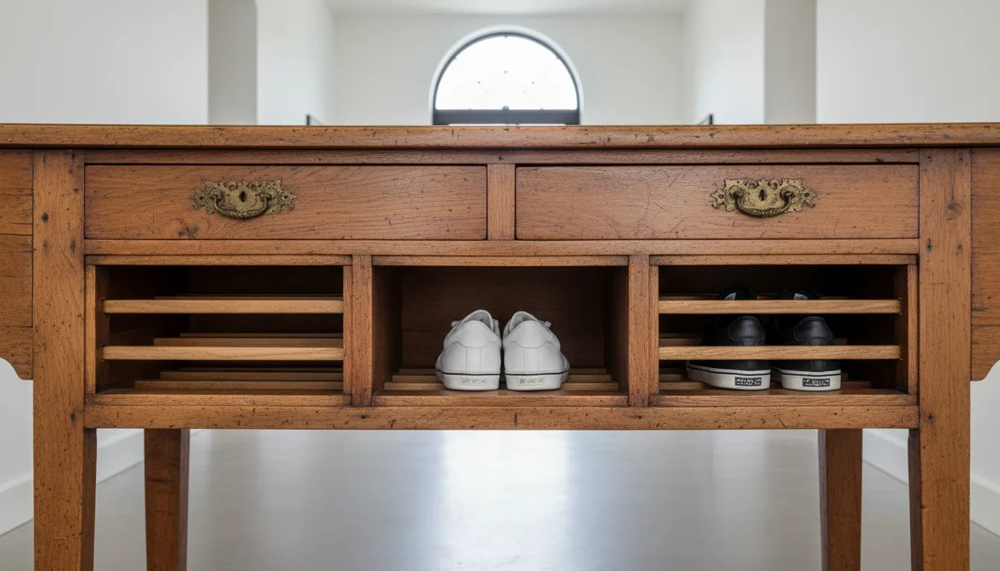
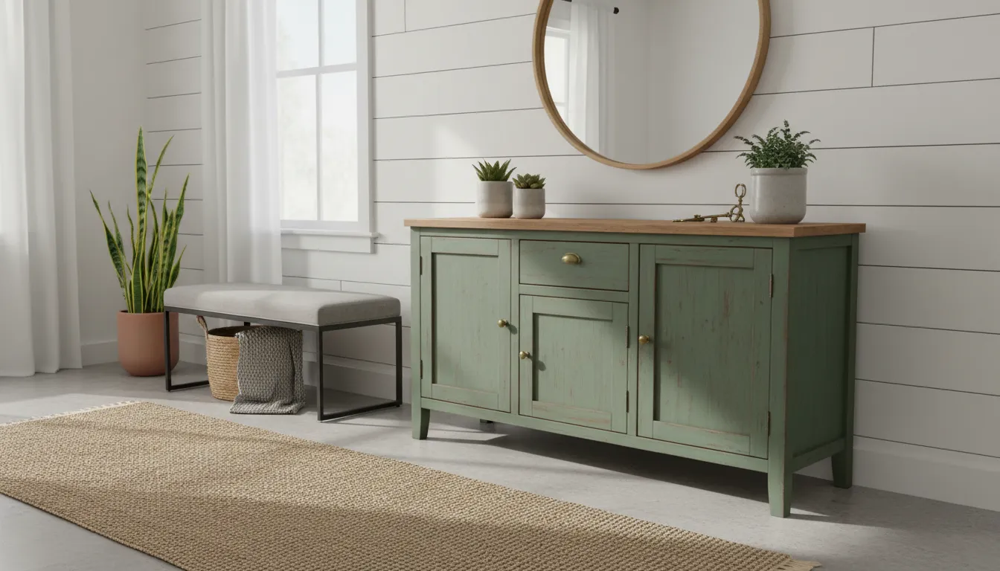

# Upcycling Old Furniture into Unique Entryway Shoe Storage

The entryway is the handshake of the home. It is the first space that greets you upon arrival and the last thing you see before departing. Yet, functionally, it often becomes a chaotic repository for footwear, leading to cluttered walkways and a disorganized aesthetic. While modern retailers offer a plethora of particle-board shoe racks, there is a distinct lack of character in mass-produced furniture. This is where the art of upcycling comes into play.

Transforming old furniture into unique shoe storage is not merely a cost-saving measure; it is a design statement. It allows homeowners to curate a space that reflects their personal style while diverting waste from landfills. By reimagining a tired dresser, a discarded bookshelf, or an antique armoire, you can create a bespoke storage solution that offers superior durability and timeless appeal compared to flat-pack alternatives.

In this comprehensive guide, we will explore the strategic process of sourcing, prepping, and converting vintage furniture into functional entryway masterpieces. We will delve into specific project ideas, necessary tools, and the finer details of finishing work that separates a novice DIY project from a professional-grade restoration.

## The Case for Vintage Over New

Before diving into the mechanics of restoration, it is essential to understand why vintage furniture is often the superior candidate for entryway storage. Older furniture, particularly pieces manufactured before the 1990s, was typically constructed with solid wood, dovetail joinery, and high-quality veneers. These materials can withstand the weight of heavy boots and the wear and tear of daily traffic far better than modern composite woods.

Furthermore, upcycling provides an opportunity to customize the dimensions and internal configuration of the piece. An entryway often presents unique spatial challenges—narrow hallways, awkward corners, or limited wall space. Finding a store-bought unit that fits these dimensions perfectly is rare. However, altering an existing piece of furniture allows you to tailor the solution to your specific architectural constraints.

## Assessing Your Entryway Needs

Before scouring thrift stores or estate sales, you must conduct a thorough assessment of your entryway. This planning phase is crucial to ensure the final product is not only beautiful but functional.

### Measuring the Space
Begin by measuring the available floor space. Consider the swing of the front door and the flow of traffic. The depth of the furniture is particularly critical in an entryway; a standard dresser is often 18 to 20 inches deep, which may be too intrusive for a narrow corridor. In such cases, seeking out "shallow depth" furniture, such as console tables or bookcases, is advisable.

### Inventory Analysis
Count the pairs of shoes that realistically need to live in the entryway. Do you need storage for tall winter boots, muddy hiking gear, or slim running shoes? This inventory will dictate the internal structure of your upcycled piece. For example, a piece intended for boots will require adjustable shelving or substantial vertical clearance, whereas a unit for sneakers may benefit from cubby-style dividers.

## Sourcing the Perfect Piece

Finding the right candidate for upcycling is arguably the most exciting part of the process. You are looking for "good bones"—structural integrity that lies beneath scratched varnish or dated paint colors.

### Where to Look
*   **Thrift Stores and Charity Shops**: These are excellent for finding bookshelves and smaller cabinets.
*   **Estate Sales**: Often the best source for high-quality, solid wood dressers and armoires at reasonable prices.
*   **Online Marketplaces**: allow for targeted searches. Look for terms like "solid wood," "needs work," or "project piece."
*   **Curbside**: Occasionally, perfectly good furniture is discarded simply because it is out of style.

### What to Avoid
Be wary of pieces with significant water damage, structural rot, or severe warping. While wood can be sanded and refinished, compromised structural joints or mold issues are often more trouble than they are worth. Additionally, particle board furniture that has started to swell or crumble is generally not suitable for the heavy-duty refinishing required for this type of project.

## Project 1: The Dresser Transformation

The dresser is perhaps the most versatile piece of furniture for shoe storage conversion. Its inherent depth and solid top make it an ideal console for keys and mail, while the body provides ample volume for footwear.

### The Drawer Dilemma
The primary challenge with dressers is that deep drawers can become abysses where shoes get jumbled. There are two main approaches to solving this:

1.  **Removing Drawers for Open Shelving**: This creates a more airy, open look. You can remove the drawer faces and install plywood shelves across the span of the dresser. This is excellent for easy access and displaying stylish footwear.
2.  **Modifying Drawers**: If you prefer to hide the clutter, keep the drawers but customize the interiors. You can install vertical dividers within the drawers to keep shoes upright, or simply use the drawers for smaller items like sandals and flats.

### Step-by-Step Execution
1.  **Deconstruction**: Remove all drawers and hardware. If converting to open shelving, remove the drawer runners and support brackets from the interior.
2.  **Sanding**: Thoroughly sand the exterior and the interior. If the interior was previously unfinished raw wood, it will need to be sealed to prevent it from absorbing odors and moisture from shoes.
3.  **Shelf Installation**: Measure the interior width and depth. Cut ¾-inch plywood to fit. Support these shelves using wooden cleats screwed into the side walls of the dresser carcass.
4.  **Painting and Sealing**: Apply a high-quality primer followed by a durable enamel paint. Because shoes carry dirt and grit, the durability of the finish is paramount.

## Project 2: The Bookshelf Bench Flip

One of the most popular and functional upcycling projects involves turning a sturdy bookshelf on its side to create a storage bench. This serves a dual purpose: storage for shoes below and a place to sit while putting them on.

### Selecting the Shelf
Look for a bookshelf that is constructed of solid wood or high-grade plywood. Avoid flimsy backing materials, as the "back" of the bookshelf will become the "bottom" of your bench and needs to support weight. The ideal height of the bookshelf (which becomes the length of the bench) should be between 36 and 60 inches.

### Reinforcement
Structural integrity is vital here. When a bookshelf is upright, the vertical sides bear the weight. When flipped horizontally, the shelves (now vertical dividers) and the long sides must bear the weight of a person sitting.
*   Add a solid wood base or furniture feet to lift the unit off the ground.
*   Reinforce the corners with metal L-brackets.
*   Ensure the dividers are securely fastened to the top and bottom boards.

### The Cushion Top
To transform the hard surface into a comfortable seat, create a custom cushion. Cut a piece of medium-density foam to the dimensions of the top. Wrap the foam in batting and a durable upholstery fabric, securing it to a plywood board that can then be attached to the bench top. This adds a layer of luxury and softness to the entryway.

For those looking to secure the upholstery or add trim to their bench, having the right tools is essential. A heavy-duty stapler or a powered brad nailer can expedite this process significantly.

[See Recommended Tools for Upholstery and Woodworking](https://www.amazon.com/s?k=heavy+duty+staple+gun+upholstery&tag=hats0f8-20)

## Project 3: The Armoire Command Center

For larger families, an armoire or wardrobe offers the ultimate storage capacity. Unlike a bench or dresser, an armoire utilizes vertical space, offering floor-to-ceiling organization.

### Zoning the Interior
An upcycled armoire can be divided into zones. The bottom third can be dedicated to shoe racks. The middle section can house hooks for backpacks and jackets, while the top shelf is perfect for off-season storage bins.

### Retrofitting Shoe Racks
To maximize shoe storage within an armoire, consider installing slanted shelves. Slanted shelves allow you to see your shoes easily and accommodate more pairs in a shallower depth. You can create these using simple wood planks with a lip attached to the front edge, installed at a 15-degree angle.

Alternatively, installing heavy-duty pull-out runners with wire baskets can make accessing shoes in the back of a deep armoire effortless.

## Essential Restoration Techniques

Regardless of the furniture piece you choose, the difference between a "craft project" and a high-end furniture hack lies in the finish.

### Surface Preparation
Never skip sanding. Even if you plan to use "no-prep" chalk paint, scuff sanding provides a mechanical bond for the new finish. For surfaces with heavy varnish, start with 80-grit sandpaper and work your way up to 220-grit for a smooth finish.

If the furniture has an existing smell—common with vintage pieces—seal the raw wood with a shellac-based primer. Shellac is excellent at locking in odors and preventing tannins from bleeding through your paint.

### Painting for Durability
Entryway furniture takes a beating. Muddy boots, wet umbrellas, and keys thrown on surfaces require a robust finish.
*   **Cabinet Enamel**: Use a urethane-reinforced cabinet paint. These paints cure to a hard, chip-resistant finish that is easy to wipe clean.
*   **Top Coat**: If using chalk or milk paint, you must apply a protective top coat. A water-based polyacrylic is recommended over oil-based polyurethane, which can yellow over time, especially over white paint. Apply at least three coats to horizontal surfaces.

## Hardware and Aesthetics

Replacing old hardware is the quickest way to modernize a vintage piece. If you have transformed a mid-century dresser, adding sleek, matte black pulls can give it a contemporary industrial edge. Conversely, adding glass knobs to a farmhouse cabinet can enhance its vintage charm.

When filling old hardware holes, use a two-part wood filler rather than standard wood putty. Two-part filler hardens like real wood and can be drilled and sanded without shrinking, allowing you to install new handles with different spacing.

[Browse Unique Cabinet Hardware Options](https://www.amazon.com/s?k=vintage+cabinet+pulls+and+knobs&tag=hats0f8-20)

## Internal Organization and Protection

Once the structure is complete, focus on the interior utility. The goal is to protect your newly refinished piece from the very items it is designed to hold: dirty shoes.

### Boot Trays and Liners
Place plastic or rubber boot trays on the shelves. This catches melting snow and mud, preventing water damage to the wood. You can cut standard boot trays to size or use heavy-duty shelf liners that are easy to remove and wash.

### Baskets and Bins
For items that don't sit well on shelves, such as flip-flops or dog walking accessories, utilize baskets. Woven hyacinth or wire baskets add texture and hide visual clutter. If you have removed drawers from a dresser, baskets can slide into the open cubbies to act as "faux drawers."

[Shop Durable Woven Storage Baskets](https://www.amazon.com/s?k=woven+storage+baskets+for+shelves&tag=hats0f8-20)

## Design Cohesion

Your upcycled shoe storage should not exist in a vacuum; it needs to integrate with the rest of your entryway decor.

### Color Theory
Choose a paint color that anchors the space. Deep navies, charcoal grays, and forest greens hide scuff marks well and add drama. If your entryway is small and lacks natural light, consider a creamy white or light greige to reflect light, but be prepared for more frequent cleaning.

### The Surroundings
Style the area around the storage unit. A large mirror placed above a console-style shoe cabinet allows for a final outfit check and reflects light, making the entryway appear larger. Flank the unit with tall plants to soften the edges, or add a runner rug to lead the eye into the home. For more ideas on how to style tight spaces, read our guide on [maximizing small entryway spaces](/posts/maximizing-small-entryway-spaces).

## Maintenance of Upcycled Furniture

Preserving your creation requires simple but regular maintenance.
*   **Immediate Cleanup**: Wipe up water spills immediately. Even sealed wood can swell if moisture is left to sit.
*   **Seasonal Deep Clean**: Once a season, empty the unit. Vacuum out the interiors to remove sand and grit which can act like sandpaper on your finish. Wipe down the shelves with a mild soap solution.
*   **Touch-ups**: Keep a small jar of your paint and a small artist's brush handy for touching up chips and scratches as they happen.

## Conclusion

Upcycling old furniture into entryway shoe storage is a rewarding endeavor that blends creativity with practicality. It challenges the throw-away culture of modern consumerism and results in a piece of furniture that is uniquely yours. Whether you are transforming a mid-century dresser into a sleek sneaker station or turning a bookshelf into a cozy farmhouse bench, the principles remain the same: assess your needs, prep your materials diligently, and finish with durability in mind.

By investing time and effort into restoration, you not only solve the perennial problem of shoe clutter but also create a welcoming, organized entry that sets a tone of intention and care for the rest of your home. The next time you see a discarded piece of furniture, look past the dust and scratches, and visualize the potential for a beautiful, bespoke storage solution.

For further inspiration on organizing your home, explore our article on [creating a mudroom in a home without one](/posts/creating-a-mudroom-no-mudroom).