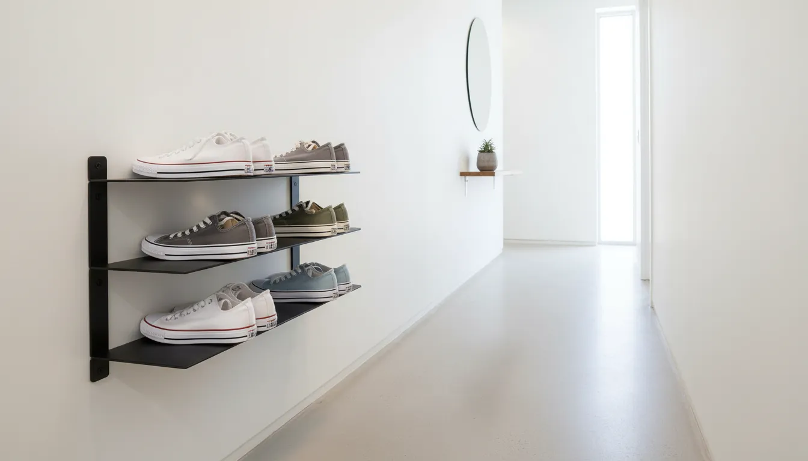
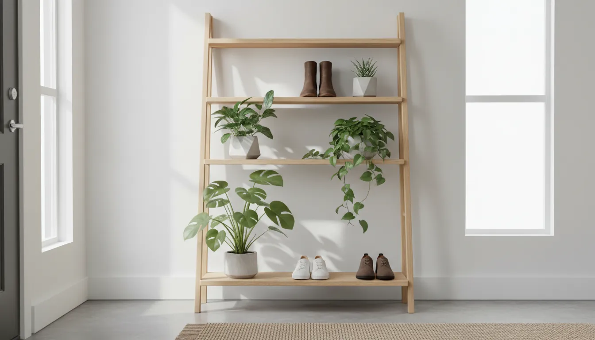
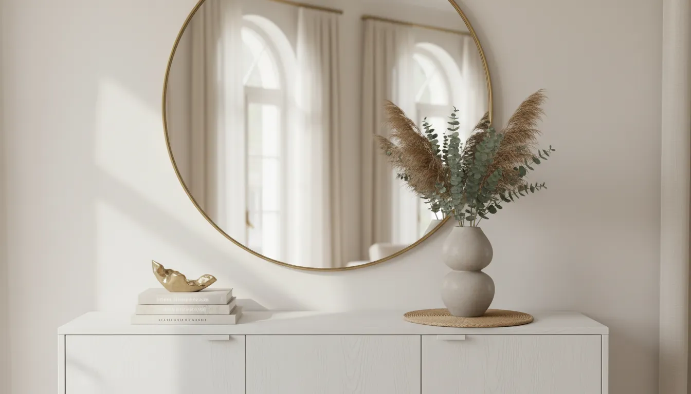

# Vertical Shoe Storage Solutions: Maximizing Height in Narrow Entryways

The entryway is the handshake of the home. It is the first space that greets you upon arrival and the last thing you see before departing. However, for many living in urban apartments, townhouses, or older homes, this handshake is often less of a warm welcome and more of a chaotic obstacle course. The primary culprit is almost always footwear. Shoes are voluminous, irregularly shaped, and accumulate rapidly, creating a clutter distinct from mere papers or keys.

When the footprint of a foyer is limited, the traditional approach of spreading out—using wide racks or floor mats—is insufficient. It creates a bottleneck that hampers the flow of movement and creates visual noise. The solution lies not in expanding outward, but in expanding upward. Vertical shoe storage solutions allow homeowners to reclaim their floor space, utilizing the often-ignored cubic footage of the room’s walls. By shifting the focus from square footage to verticality, you can transform a cramped corridor into a streamlined, functional, and aesthetically pleasing gallery of organization.

This comprehensive guide explores the architectural and practical applications of vertical storage in narrow entryways, offering solutions that range from built-in cabinetry to clever, renter-friendly hacks.

## The Spatial Philosophy of the Narrow Entryway

Before purchasing furniture or drilling holes, it is essential to understand the spatial dynamics of a narrow hall. In interior design, the "landing strip" concept dictates that a hallway must remain clear enough to walk through comfortably—typically requiring a minimum of 36 inches of clearance for comfortable passage, though 42 inches is ideal. When a shoe rack protrudes 12 to 15 inches into a 48-inch hallway, the space immediately feels claustrophobic.

Vertical storage addresses this by prioritizing depth reduction. By stacking storage vertically, we can utilize slimmer profiles—often as shallow as 7 to 10 inches—while maintaining, or even increasing, the total storage capacity. This approach serves two functions: utilitarian storage and visual elongation. Tall, slender furniture draws the eye upward, emphasizing the ceiling height rather than the narrowness of the floor, creating an illusion of volume and airiness.

### Assessing Your Vertical Potential

To maximize height, you must first map the territory. Grab a tape measure and assess the following:

1.  **Wall Height:** Standard ceilings are 8 feet, but older properties may go higher. Know your limit.
2.  **Baseboard Obstructions:** Many storage units sit flush against the wall. If you have thick baseboards, you may need wall-mounted units or furniture with legs that clear the trim.
3.  **Stud Placement:** Vertical storage often carries significant weight. If you plan to float shelves or anchor heavy cabinets, locating wall studs is non-negotiable for safety.
4.  **Door Clearance:** Ensure that any unit placed behind a door allows the door to open fully without banging against the cabinetry.

## The Slim Tip-Out Cabinet: A Modern Classic

The undisputed champion of the narrow entryway is the tip-out shoe cabinet. Unlike traditional shelving where shoes sit flat (requiring 12+ inches of depth), tip-out cabinets store shoes at an angle. This geometric shift allows the cabinet depth to shrink to as little as 6 to 9 inches while still accommodating men's size 12 footwear or chunky boots.

These units act as architectural chameleons. When closed, they resemble sleek console tables. They hide the visual clutter of laces, mud, and mismatched heels behind a solid facade, providing a clean surface for keys, mail, and decorative elements.

For narrow spaces, look for units that stack three or four compartments high rather than two compartments wide. This configuration minimizes the floor footprint while utilizing the dead space below eye level.

If you are seeking a high-quality foundation for your entryway, consider investing in a dedicated slim cabinet.

[Check price for Slim Tip Out Shoe Cabinet on Amazon](https://www.amazon.com/s?k=slim+tip+out+shoe+cabinet&tag=hats0f8-20)

### Installation and Customization
While many tip-out cabinets are freestanding, anchoring them to the wall is critical. The center of gravity changes when the drawers are opened, creating a tipping hazard. For a built-in look, remove the baseboard behind the cabinet so it sits flush against the wall, or caulk the gap between the cabinet and the wall for a seamless finish. To integrate the unit further, paint it the same color as your walls. This "drenching" technique makes the storage disappear visually, reducing the sense of heaviness in a small corridor.

## Wall-Mounted Racks and Floating Systems

When floor space is at an absolute premium—or perhaps non-existent—suspension is the answer. Wall-mounted systems completely liberate the floor, making vacuuming easier and keeping the entryway looking expansive.

### The Floating Shelf Approach
Floating shelves are not just for books. Installing a vertical column of short floating shelves creates a gallery-like display for your footwear. This works exceptionally well for sneaker enthusiasts who wish to display their collection. However, for the average household, open shelving requires discipline. It demands that shoes be kept clean and organized, as there are no doors to hide the mess.

To maintain elegance, space the shelves equally, ensuring enough height between them for your tallest ankle boots. Use wood or metal shelves that complement the flooring to create a cohesive material palette.

### Tension Rods and Rails
For a more industrial or utilitarian look, tension rod systems or wall-mounted rails offer high-density storage. Metal rails allow you to hook heels or wedge toes securely. These systems are often modular, meaning you can add more rails as your family—or your shoe collection—grows.

For a robust, industrial-style solution that keeps shoes off the floor entirely, metal wall racks are an excellent choice for durability and hygiene.

[Check price for Wall Mounted Metal Shoe Rack on Amazon](https://www.amazon.com/s?k=wall+mounted+metal+shoe+rack&tag=hats0f8-20)

## The High-Density Rotating Tower

Borrowing from the retail industry, rotating shoe towers (often called Lazy Susans) are a powerhouse of vertical efficiency. These are typically cylindrical or square towers that spin 360 degrees. A single tower with a diameter of 24 inches can hold upwards of 30 pairs of shoes, capitalizing on the depth of a corner rather than the length of a wall.

These are ideal for corners of entryways where a long cabinet won't fit. The rotating mechanism brings the shoes to you, eliminating the need to dig through dark cupboards. While they can be visually dominant, placing them in a "dead corner" transforms wasted space into a storage powerhouse. Modern versions come in mirrored finishes, which help reflect light and make the unit feel less imposing.

## Harnessing the Door: Beyond Plastic Pockets

The back of a closet door or the main entry door is often the most underutilized vertical surface in the home. Historically, over-the-door organizers have been associated with cheap, flimsy plastic pockets that rip easily and look unsightly. However, the market has evolved.

Modern over-the-door solutions utilize rigid metal structures and wire mesh baskets that rival permanent shelving in stability. These systems clip securely to the top and bottom of the door, preventing the "swing and bang" effect every time the door is opened.

For narrow entryways that open directly into a living space, using the back of the coat closet door for shoes is a strategic move. It keeps the visual clutter completely hidden while keeping the shoes accessible. When selecting a unit, prioritize those with deep baskets rather than flat rails, as baskets prevent shoes from sliding out when the door is moved vigorously.

[Check price for Heavy Duty Over The Door Shoe Rack on Amazon](https://www.amazon.com/s?k=heavy+duty+over+the+door+shoe+rack&tag=hats0f8-20)

## The Ladder Shelf: A Tiered Perspective

If you prefer furniture that feels less like "storage" and more like "decor," the ladder shelf is a viable vertical contender. Leaning ladder shelves taper toward the top, which reduces their visual weight. The wider bottom shelves can accommodate boots or baskets for loose items, while the narrower top shelves are perfect for lighter shoes or decorative plants.

This tapered design is psychologically effective in narrow hallways. Because the unit recedes from the viewer as it goes up, it does not feel like it is looming over the walkway. It provides an open, airy aesthetic that solid cabinetry cannot match. To maximize utility, use matching baskets on the lower rungs to conceal flip-flops and sandals, keeping the aesthetic clean.

## DIY Solutions: Pegboards and Custom Joinery

For those with irregular wall shapes or specific aesthetic requirements, off-the-shelf products may not suffice. Customizing your vertical storage allows you to navigate around fuse boxes, intercoms, and awkward architectural quirks.

### The Architectural Pegboard
Pegboards are a staple of garage organization, but when executed in high-quality birch plywood or painted to match the interior trim, they become sophisticated modular systems. By installing a floor-to-ceiling pegboard, you can insert dowels to hang shoes by the heel or install small shelves for flat storage. The beauty of this system is its flexibility; as winter turns to summer, you can rearrange the dowels to accommodate sandals instead of boots without any tools.

### Recessed Storage (Between the Studs)
If you are undertaking a renovation, the ultimate vertical solution is recessed shelving. By cutting into the drywall and utilizing the cavity between wall studs (typically 3.5 inches deep), you can create storage that does not encroach on the hallway width at all. While 3.5 inches is too shallow for shoes to sit flat, installing bars to hold shoes by the toes or heels allows for flush storage. Add a door over the recess, and you have a secret shoe closet that is completely invisible.

## Seasonal Rotation and "Active" Storage

Even with the best vertical solutions, a narrow entryway cannot hold every pair of shoes you own. The key to maintaining a functional space is the concept of "active" versus "archive" storage.

Your vertical entryway storage should be reserved for **active footwear**—the pairs you wear currently. In winter, this means boots and sturdy sneakers. In summer, it switches to loafers and sandals.

**The Archive Strategy:**
Off-season footwear should be cleaned, boxed, and relocated to less valuable real estate, such as under-bed storage, the top of a bedroom closet, or a basement. This rotation should happen twice a year. By limiting the entryway to only what is necessary, you reduce the strain on your vertical systems and ensure that the items you need are always within reach. For more tips on managing household overflow, consider reading our guide on [seasonal storage rotation strategies](/posts/seasonal-storage-rotation-strategies).

## Aesthetic Integration: Decorating the Vertical

Vertical storage serves a function, but it is also a major visual element in your home's entrance. Integrating it into your decor is essential to prevent the "locker room" effect.

**1. The Console Top:**
If using a tip-out cabinet, the top surface is prime styling real estate. Treat it like a console table. Place a catch-all tray for keys (containing the clutter), a small table lamp for ambiance, and a sculptural element.

**2. Mirrors and Light:**
Hang a large vertical mirror above your shoe storage. Mirrors are the oldest trick in the designer’s book for a reason: they bounce light and double the perceived width of a narrow hall. If your storage unit is tall, consider a long mirror on the adjacent wall.

**3. Lighting:**
Narrow hallways are often dark. Incorporate lighting into your storage. LED strip lights under floating shelves or inside open cabinets add a layer of sophistication and make it easier to find matching pairs in the morning.

## Maintenance and Hygiene in Vertical Spaces

Vertical storage presents unique challenges regarding hygiene. In a horizontal rack, dirt falls to the floor. In a vertical stack, dirt from the shoes above can fall into the shoes below.

**The Dirt Barrier:**
Ensure your storage solution has solid shelves or liners. If using wire racks or open slats, place easy-to-clean plastic liners on the shelves to catch debris.

**Odor Management:**
Heat rises, and in a tall, enclosed cabinet, odors can accumulate. Use charcoal sachets or cedar blocks on every level of your vertical storage. Ensure that shoes are dry before placing them in enclosed cabinets to prevent mold growth.

**Wall Protection:**
Wall-mounted racks can lead to scuff marks from rubber soles. Consider installing a washable wallpaper or a sheet of clear acrylic behind the rack to protect the paintwork.

## Conclusion: ascending Above the Clutter

The narrow entryway need not be a source of frustration. It is simply a puzzle that requires a change in perspective. By looking up, we unlock the potential of the vertical plane, transforming blank walls into engines of organization.

Whether you opt for the seamless concealment of a tip-out cabinet, the industrial efficiency of wall-mounted rails, or the hidden utility of an over-the-door system, the goal remains the same: to create a passage that is unobstructed, functional, and welcoming.

Vertical shoe storage is more than just a space-saving hack; it is a design choice that prioritizes flow and order. By implementing these strategies, you ensure that the first step into your home is always a step in the right direction. For further inspiration on maximizing small footprints, explore our deep dive into [small hallway decor ideas](/posts/small-hallway-decor-ideas).