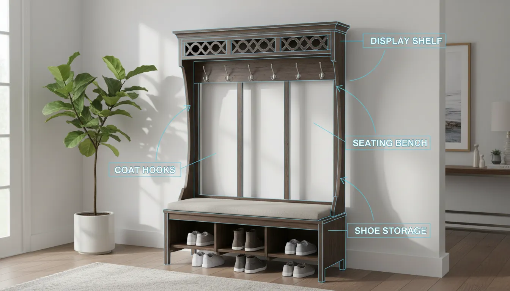
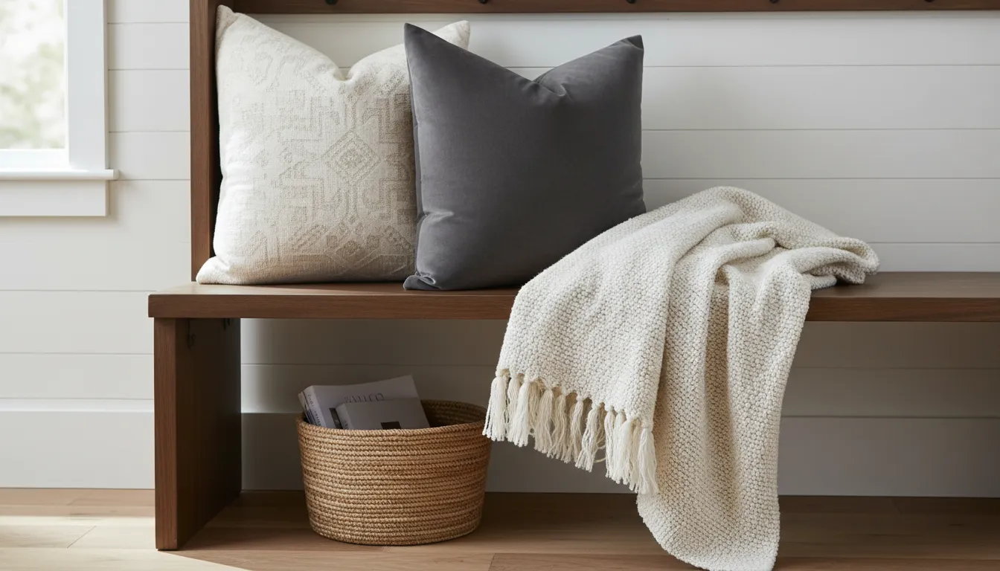

# What is a Hall Tree? Defining the Essential Entryway Organizer

The entryway is the handshake of the home. It is the first space guests encounter and the final checkpoint before you step out into the world. Despite its importance, this transitional zone often falls victim to clutter. Shoes pile up near the door, coats are draped over bannisters, and keys vanish into the abyss of unidentified tabletops. Enter the hall tree: a piece of furniture designed specifically to tame this chaos while adding significant aesthetic value to your foyer.

But what exactly is a hall tree? Is it merely a coat rack, or is it something more substantial? In the realm of interior design and home organization, a hall tree is a multifunctional unit that combines seating, storage, and hanging space into a single, cohesive structure. It acts as a comprehensive "drop zone," providing a dedicated place for the items we use daily but struggle to store neatly.

This comprehensive guide will explore the anatomy of the hall tree, its historical evolution, the vast array of styles available, and how to select the perfect unit to revolutionize your entryway organization.

## The Anatomy of a Hall Tree

To understand the utility of a hall tree, one must dissect its components. While designs vary from minimalist metal frames to ornate wooden heirlooms, the core DNA of the furniture piece remains consistent. It is a hybrid solution, merging several distinct pieces of furniture into one vertical footprint.

### 1. The Bench Seat
Perhaps the most defining feature that separates a hall tree from a standard coat rack is the integrated bench. This seating area serves a practical purpose, offering a stable place to sit while putting on or taking off shoes. For families with young children or elderly members, this accessibility is invaluable. The bench also serves as a momentary landing pad for heavy grocery bags or purses immediately upon entering the home.

### 2. Vertical Storage and Hooks
The "tree" aspect of the name is derived from the upper section of the unit, which features hooks, pegs, or knobs. These are designed to hold coats, jackets, scarves, hats, and dog leashes. By utilizing vertical space, a hall tree keeps bulky outerwear off the floor and easily accessible. High-end models may feature double-pronged hooks to maximize hanging capacity.

### 3. Upper and Lower Storage Zones
Beyond the bench and hooks, a well-designed hall tree often incorporates additional storage options:
*   **Cubbies or Shelves:** Located at the very top (the "crown") or directly beneath the bench.
*   **Drawers:** Integrated into the bench base for concealing smaller items like gloves, mail, or keys.
*   **Shoe Storage:** Many units feature open shelves or compartments at ground level specifically designed to house footwear, keeping the entryway floor clear of tripping hazards.

## A Brief History: From Victorian Utility to Modern Staple

The concept of the hall tree creates a bridge between historical necessity and modern convenience. Its origins can be traced back to the Victorian era in Britain and America. During the mid-to-late 19th century, the entryway or "hall" became a pivotal space in middle- and upper-class homes. It was a buffer zone between the public street and the private sanctuary of the parlor.

Victorian hall trees were often imposing, ornate structures made of dark woods like mahogany, oak, or walnut. They were status symbols as much as they were functional items. These early iterations almost always included a mirror (to check one's appearance before entering the parlor) and a drip pan for wet umbrellas—a necessity in the rainy climates of the time.

As architectural styles shifted toward the mid-century modern and contemporary eras, the hall tree evolved. The intricate carvings and heavy mirrors gave way to cleaner lines, mixed materials, and a focus on space efficiency. However, the fundamental purpose remained unchanged: to organize the transition from outdoors to indoors.

## Why Your Home Needs a Hall Tree

Investing in a hall tree is rarely a decision homeowners regret. The benefits extend beyond simple storage, impacting the flow and feel of your daily life.

### The "Drop Zone" Psychology
Human beings are creatures of habit. When we enter our homes, we have a natural tendency to unburden ourselves immediately. Without a designated spot, keys end up on the kitchen counter, coats on the sofa, and mail on the dining table. A hall tree creates a centralized "drop zone." It creates a psychological trigger: when you walk in, items go *here*. This containment strategy is essential for maintaining a tidy home environment.

### Maximizing Vertical Real Estate
In many homes, especially urban apartments or smaller houses, floor space is at a premium. Traditional storage solutions often require significant square footage. A hall tree takes advantage of vertical space. By building up rather than out, you gain the storage capacity of a small closet without sacrificing the width of your hallway. This makes it an ideal solution for narrow foyers where a deep closet or bulky cabinet would obstruct traffic.

### Aesthetic Anchoring
An entryway can often feel disjointed or empty. A hall tree acts as an anchor piece, providing a focal point that grounds the space. It offers an opportunity to introduce style and personality immediately upon entry. whether you prefer the rustic charm of a farmhouse look or the sleek lines of industrial design, the furniture piece sets the tone for the rest of the home.

## Types and Styles: Finding Your Match

The market is saturated with various interpretations of this classic furniture piece. Identifying the right style for your home depends on your decor theme and your specific storage requirements.

### The Modern Farmhouse Hall Tree
Currently one of the most popular styles, the farmhouse hall tree emphasizes warmth and practicality. These units often feature beadboard backing, distressed wood finishes (often in whites, greys, or natural oaks), and antique-style hardware. They blend seamlessly into family homes and often prioritize robust storage with large baskets and sturdy benches.

For those looking to achieve this aesthetic, consider looking for units that combine wood warmth with practical storage.
[Shop for Farmhouse Hall Trees](https://www.amazon.com/s?k=farmhouse+hall+tree+bench&tag=hats0f8-20)

### The Industrial Hall Tree
Industrial designs strip the concept down to its raw essentials. Typically constructed from a combination of black metal piping or frames and reclaimed wood accents, these units are airy and less visually heavy than their wooden counterparts. The open frame design is excellent for smaller spaces as it allows light to pass through, preventing the hallway from feeling cramped.

### The Corner Hall Tree
A brilliant solution for awkward spaces, the corner hall tree is triangular in design, fitting snugly into a 90-degree corner. While these units typically offer less bench width, they utilize "dead space" that would otherwise go unused. This is a favored option for studio apartments or homes with small vestibules.

### The Hall Tree with Storage Bench (The "Mudroom" Look)
Some hall trees are massive, substantial pieces designed to mimic built-in cabinetry. These are often referred to as "mudroom lockers." They may feature separate vertical cubbies for different family members, closed cabinetry to hide clutter completely, and substantial depth. These are best suited for large families with significant athletic gear or winter wear requirements.

## Material Matters: Durability and Maintenance

Because a hall tree endures high traffic—wet raincoats, muddy boots, and heavy bags—the material you choose matters significantly.

### Solid Wood
The gold standard for longevity. Hardwoods like oak, maple, and cherry are durable and can be refinished over time. However, solid wood units are heavy and come with a higher price tag. They are susceptible to water damage if not properly sealed, so wet umbrellas and coats should be monitored.

### Engineered Wood (MDF/Particle Board)
The most common material for affordable, flat-pack furniture. Engineered wood is versatile and can be finished with durable laminates or veneers. While cost-effective, these materials are less tolerant of moisture. If the laminate chips and water seeps into the particle board, it can swell and warp. If you choose this material, ensure the "wet zones" (where shoes and umbrellas sit) are protected.

### Metal
Metal hall trees offer superior durability and resistance to moisture. They are lightweight, easy to clean, and generally impervious to the wear and tear of zippers and buckles. However, they may lack the "warmth" and enclosed storage capabilities of wooden units.

## Measuring for the Perfect Fit

Before purchasing, accurate measurement is non-negotiable. A hall tree that is too large can block door swings or narrow the hallway to a claustrophobic degree.

1.  **Measure Width:** Ensure the unit fits on the wall without obstructing door frames or light switches.
2.  **Measure Depth:** This is critical. You must maintain a clear walking path. In a standard hallway, you generally want at least 36 inches of clearance between the front of the unit and the opposite wall.
3.  **Measure Height:** While taller units offer more storage, ensure they fit under any ceiling moldings or light fixtures.
4.  **Check for Baseboards:** Many hall trees have flat backs. If you have thick baseboards, the unit won't sit flush against the wall unless it has a cutout or legs that accommodate the trim.

## Hall Trees vs. Other Entryway Solutions

It is helpful to distinguish the hall tree from its competitors to ensure it is the right choice for your specific needs.

### Hall Tree vs. Coat Rack
A standard coat rack is a single pole with hooks. It has a tiny footprint and is very cheap. However, it offers no seating, no shoe storage, and can easily tip over if unbalanced. Choose a coat rack only if you have zero floor space for a bench.

### Hall Tree vs. Entryway Table
An entryway table (or console table) is purely for decor and small items (keys, mail). It offers no solution for coats or shoes. For a comprehensive guide on mixing these elements, see our article on [Styling Entryway Consoles](/posts/styling-entryway-consoles-for-impact).

### Hall Tree vs. Built-In Mudroom
A built-in mudroom is custom carpentry attached to the home. It adds property value and maximizes every inch of space but costs thousands of dollars more than a freestanding hall tree. A hall tree offers 80% of the functionality of a built-in at a fraction of the cost and is portable if you move.

## Organization Hacks for Your Hall Tree

Once you have your hall tree, the challenge becomes keeping it organized. Without a system, it can quickly become a vertical junk drawer.

### The Basket System
Baskets are the secret weapon of entryway organization. Use baskets on the upper shelves for seasonal items (winter gloves in summer, beach hats in winter). Use baskets under the bench for shoes. Assigning a specific basket to each family member can drastically reduce clutter.

[Shop for Woven Storage Baskets](https://www.amazon.com/s?k=woven+storage+baskets+for+shelves&tag=hats0f8-20)

### Seasonal Rotation
Do not treat your hall tree as long-term storage. It is a transit zone. Only the current season's coats should be on the hooks. In April, move the heavy parkas to the bedroom closet and bring out the light rain jackets. This prevents the hooks from becoming overcrowded and the unit from looking messy.

### Anchor for Safety
Because hall trees are tall and often top-heavy (especially when loaded with coats), they pose a tipping risk. This is particularly dangerous in homes with children who may climb on the bench. Always use wall-anchoring hardware to secure the top of the unit to a stud in the wall.

## Staging and Styling: Making it Beautiful

Functionality is key, but aesthetics matter. Your hall tree is part of your decor.

*   **Add Textiles:** Soften the hard lines of a wooden or metal bench with throw pillows or a seat cushion. This adds color and texture.
*   **Greenery:** Place a potted plant on the top shelf or hang a small planter from one of the hooks to introduce life and freshness to the entryway.
*   **Lighting:** If your hall tree has a top shelf, consider running a small LED strip light or placing a battery-operated puck light to illuminate the bench area.

## Troubleshooting Common Hall Tree Issues

**Problem: The unit looks cluttered.**
**Solution:** You have too many items on display. Implement the "Rule of Three": only three items per hook max. Move off-season items to deep storage. Utilize opaque baskets to hide visual clutter like scarves and dog toys.

**Problem: The bench is too low/high.**
**Solution:** Standard seat height is 18-19 inches. If it feels too low, add a thick foam cushion. If too high, use the space underneath for taller boots rather than standard shoes.

**Problem: Dampness and odors.**
**Solution:** If shoes are damp, do not place them directly into an enclosed cubby. Use a boot tray near the unit for drying. Consider placing a small charcoal deodorizer bag in the shoe compartments.

## DIY vs. Buying Pre-Made

For the handy homeowner, building a hall tree is a popular project. It allows for custom sizing and color matching. A common DIY hack involves purchasing a pre-made storage bench and mounting a separate shelf with hooks above it, then installing shiplap or beadboard paneling on the wall between them to create the illusion of a single unit.

However, for those seeking immediate solutions and furniture-grade finishes, buying pre-made is often more cost-effective when factoring in the price of lumber and paint.

[Shop for DIY Style Entryway Organizers](https://www.amazon.com/s?k=entryway+organizer+furniture&tag=hats0f8-20)

## Conclusion

So, what is a hall tree? It is arguably the most hardworking piece of furniture in a home. It serves as a butler, a closet, a bench, and a design statement all in one. By consolidating your entryway storage into one vertical footprint, you reclaim your floor space and streamline your daily routine.

Whether you opt for a sleek industrial model for your city apartment or a grand wooden piece for your suburban foyer, the addition of a hall tree signals a commitment to order and hospitality. It ensures that the first step into your home is a step into serenity, not clutter.

For more ideas on maximizing your home's potential, check out our guide on [Small Foyer Decorating Tips](/posts/small-foyer-decorating-tips) or explore [Shoe Storage Solutions](/posts/entryway-shoe-storage-ideas) to pair with your new hall tree.