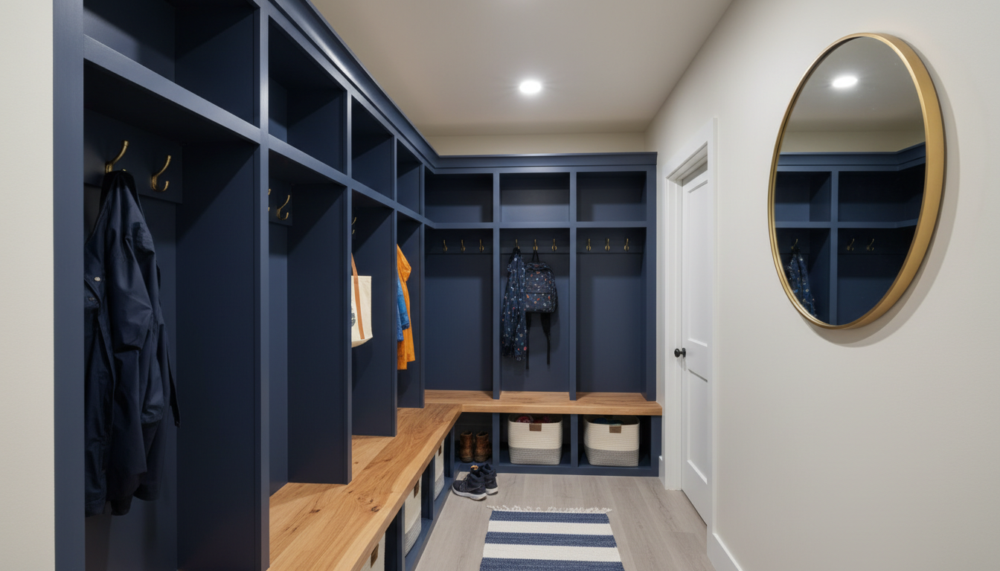
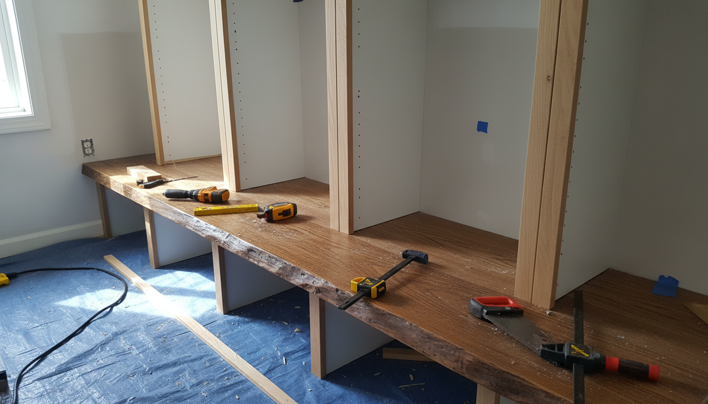
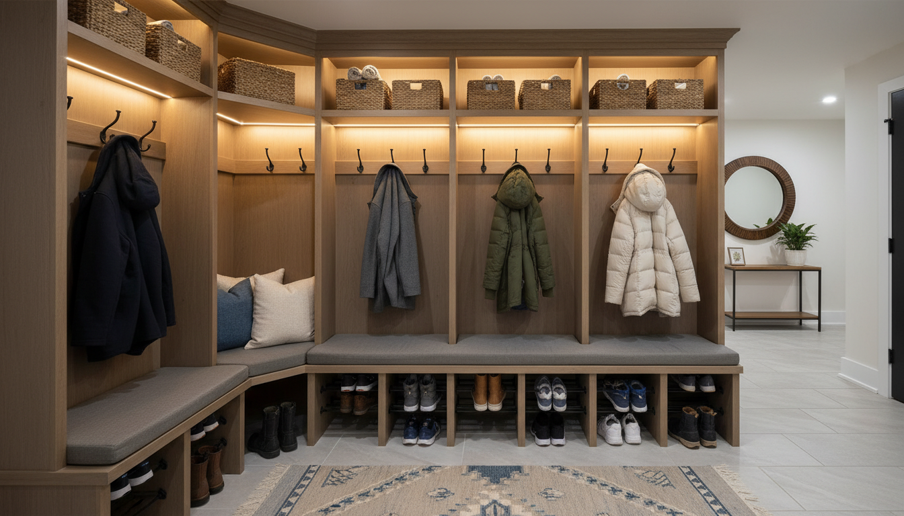

# Why Every Home Needs a Mudroom Locker System (Even If You Don't Have a Mudroom)

The door opens, and the chaos begins. Backpacks hit the floor with a thud, shoes are kicked off into a haphazard pile that becomes a tripping hazard, and coats are draped over the nearest chair—or worse, the banister. If this scene sounds familiar, you are not alone. It is the plight of the modern household: the battle against the "drop zone."

For many homeowners, the dream is a sprawling, dedicated mudroom—a room specifically designed to handle the transition from the outdoors to the indoors. But what if your floor plan doesn't include that luxury? What if your front door opens directly into your living room, or your garage entry is nothing more than a narrow hallway?

Here is the secret interior designers and professional organizers swear by: **You do not need a mudroom to have a mudroom locker system.**

In fact, incorporating a locker-style storage system into your entryway, hallway, or laundry area is one of the most impactful upgrades you can make for your home’s functionality and organization. This comprehensive guide will explore why a **mudroom locker system** is essential for every home, how to implement **small space entryway solutions**, and why this furniture piece is the ultimate cure for clutter.

## What Exactly is a Mudroom Locker System?

Before we dive into the *why*, let’s define the *what*. When we speak of "lockers" in a residential context, we aren't talking about the noisy, gray metal boxes from your high school hallway (though industrial styles are gaining popularity).

A residential **mudroom locker system** is a piece of joinery or furniture that typically combines three essential elements:
1.  **Lower Storage:** Usually in the form of drawers or open cubbies for **family shoe storage**.
2.  **Seating:** A bench area that allows you to sit down comfortably to put on or take off shoes.
3.  **Vertical Storage:** The "locker" portion, often featuring hooks for coats and bags, sometimes separated by dividers to give each family member their own designated zone.
4.  **Upper Storage:** Shelves or cabinets above the hooks for seasonal items or baskets.

This vertical integration is what separates a locker system from a standard shoe rack or coat stand. It utilizes the height of your room to maximize storage footprint, making it ideal for tight spaces.

## The Psychology of "A Place for Everything"

One of the primary reasons homes feel cluttered isn't necessarily because we have too much stuff (though that plays a part), but because the stuff doesn't have a designated home. When a child walks in the door, if there isn't a specific hook for their backpack, the floor becomes the default option.

A **mudroom locker system** leverages the psychological concept of "zoning." By assigning a specific "locker" or vertical section to each family member, you create accountability.

*   **For Kids:** It builds a routine. School bag goes on the hook, shoes go in the bottom cubby, hat goes in the top basket. It simplifies their morning and afternoon transitions.
*   **For Adults:** It reduces decision fatigue. You know exactly where your keys, purse, and dog leash are located.
*   **For Guests:** It signals that yours is a home of order, providing them a clear place to hang their coat without having to ask.

## Implementing Lockers Without a Mudroom

The biggest misconception is that you need a dedicated room to install these systems. This couldn't be further from the truth. In fact, locker systems are often *more* critical in homes without mudrooms because you lack the luxury of a room where you can simply close the door on the mess.

Here is how you can integrate **entryway organization** into various "non-mudroom" spaces:

### 1. The Hallway Transformation
If you have a long hallway leading from a garage or side door, you have prime real estate for a locker system. The key here is depth. Standard cabinets might be 24 inches deep, which can crowd a hallway. However, many **hall tree with bench** units are designed with a slim profile (16 to 18 inches deep), allowing for passage while still providing ample storage.

### 2. The Living Room "Drop Zone"
For homes where the front door opens directly into the living area, a standalone locker unit can act as a room divider or a statement furniture piece. By choosing a unit with high-quality woodwork or molding, the storage system feels like an intentional part of the living room decor rather than a utilitarian rack.

If you are looking for a solution that bridges the gap between furniture and storage, a high-quality hall tree is the perfect entry point.

**Product Recommendation:**
For a versatile, standalone option that fits most standard entryways, consider a robust hall tree.
**[Check out Hall Trees with Storage Benches on Amazon](https://www.amazon.com/s?k=hall+tree+with+storage+bench&tag=hats0f8-20)**
*These units typically offer the classic locker look with beadboard backing and ample hooks, requiring zero construction skills beyond basic assembly.*

### 3. The Laundry Room / Garage Hybrid
If your home lacks a foyer but has a laundry room or a garage entry, this is the ideal "dirty" zone. Here, you can opt for more durable materials. If you are placing the system *inside* the garage, you might want to look at metal options that are impervious to humidity and temperature changes.

### 4. The Staircase Nook
The space under a staircase is often wasted. Custom or modular **DIY mudroom lockers** can be fitted into these triangular spaces, providing graduated storage heights that look architectural and custom-built.

## The Core Benefits of Mudroom Lockers

Why should you invest time and money into this specific type of storage?

### Massive Reduction in Visual Clutter
Coats are bulky. Backpacks are shapeless. Shoes are messy. When these items are scattered, they occupy a massive amount of visual space. A locker system consolidates them into a single vertical plane. Even if the lockers are open (no doors), the structure of the cubbies creates visual rhythm and order, making the items look tidier instantly.

### Preservation of Floors and Furniture
When shoes have a designated cubby in a **mudroom locker system**, they aren't being walked across your hardwood floors or carpets. Wet raincoats hang over the bench rather than dripping on your velvet armchair. This containment strategy prolongs the life of your home's finishes.

### Increased Home Value
Storage is one of the top features homebuyers look for. A built-in—or a high-quality standalone unit that looks like a built-in—adds perceived value to the home. It solves a problem for the potential buyer before they even move in. Real estate listings that mention "mudroom" or "custom entry storage" often see higher engagement because buyers understand the value of organization.

## Choosing the Right System: Custom vs. Pre-Built vs. DIY

Once you've decided to take the plunge, you have three main paths to acquiring your system.

### 1. Custom Built-Ins
*   **Pros:** Perfectly sized to your space (floor to ceiling), limitless finish options, maximizes every inch.
*   **Cons:** Most expensive option, requires a contractor or skilled carpenter, permanent (cannot move with you).

### 2. Modular / Pre-Built Furniture
This is the "Hall Tree" route. These are standalone pieces of furniture that you assemble and place against the wall.
*   **Pros:** Cost-effective, movable, quick installation, wide variety of styles.
*   **Cons:** Fixed dimensions might not perfectly fill a wall alcove.

For those leaning toward a more modern or industrial aesthetic—perhaps for a garage conversion or a loft apartment—metal lockers are a fantastic, durable alternative to wood.

**Product Recommendation:**
If you want something durable, perhaps for a garage entry or a teenager's room, metal lockers offer a vented, industrial-chic look.
**[Explore Metal Storage Lockers for Home on Amazon](https://www.amazon.com/s?k=metal+storage+lockers+for+home&tag=hats0f8-20)**
*These are excellent for airflow, preventing damp coats or gym bags from developing odors.*

### 3. The DIY Approach
**DIY mudroom lockers** are a popular weekend project for handy homeowners. This usually involves buying stock kitchen cabinetry or bookcases (like IKEA hacks) and adding trim, molding, and a benchtop to make them look built-in.
*   **Pros:** Custom look for a fraction of the price, high satisfaction.
*   **Cons:** Requires tools, time, and a moderate skill level.

For more ideas on constructing your own, check out our guide on [how to build a mudroom bench](/posts/how-to-build-a-mudroom-bench).

## Essential Features to Look For

Whether buying or building, ensure your system has these components for maximum utility:

### The "Sit" Factor
A bench is non-negotiable. It encourages people to take their shoes off immediately. Ideally, the bench height should be around 18 inches off the ground.

### Heavy-Duty Hardware
Winter coats and loaded backpacks are heavy. Ensure your hooks are double-pronged and anchored into solid wood or studs, not just thin backing board. Look for "architectural hooks" or "schoolhouse hooks" for the best durability.

### Shoe Cubbies vs. Drawers
Open cubbies are best for kids (they won't open a drawer to put shoes away). Drawers are better for hiding clutter but require more discipline. A mix is often the sweet spot—open space for daily shoes, drawers for out-of-season footwear.

### Moisture Resistance
If you live in a snowy or rainy climate, the bench seat and lower cubbies will see moisture. Opt for painted wood with a semi-gloss finish or a stained wood seat sealed with polyurethane. Avoid raw MDF near the floor where wet boots sit.

## Styling Your Mudroom Lockers

Function comes first, but form is a close second. Since this system is often visible from the main living areas or is the first thing guests see, it needs to look good.

### Baskets are Your Best Friend
The upper shelves of a locker system can easily become a junkyard of random hats and gloves. To maintain the aesthetic, use uniform baskets or bins. This hides the visual clutter while keeping items accessible. Woven textures add warmth, while wire bins add an industrial touch.

**Product Recommendation:**
To keep those upper shelves and lower cubbies tidy, uniform storage baskets are essential.
**[Find Woven Storage Baskets for Shelves on Amazon](https://www.amazon.com/s?k=woven+storage+baskets+for+shelves&tag=hats0f8-20)**
*Look for baskets with handles for easy retrieval from high shelves.*

### The Power of Paint
If you are adding a unit to a hallway, consider painting it a contrasting color to your walls. A deep navy, charcoal, or sage green locker system against white walls creates a stunning focal point. Alternatively, painting it the same color as the wall (color drenching) can make a bulky unit disappear visually into the room.

### Lighting
If possible, add lighting. A sconce above the unit or LED strip lighting inside the cubbies adds a high-end, custom feel and makes finding things on dark winter mornings much easier.

## Maintenance and Organization Hacks

Once your **mudroom cabinet ideas** have come to life, maintaining the order is the next challenge. Here are some pro tips:

### The "One In, One Out" Rule
Entryway storage is finite. If you buy a new winter coat, donate an old one. Do not let the lockers become a graveyard for clothes that are never worn.

### Seasonal Rotation
Use the upper baskets for off-season gear. In summer, store the wool hats and scarves up high and bring the sun hats and sunscreen to eye level. In winter, swap them. This keeps the daily hooks free from unnecessary clutter.

### The "Friday Reset"
Make it a household habit to clear the lockers on Friday. School papers are filed or recycled, lunchboxes are taken to the kitchen, and stray items are returned to their bedrooms. This ensures you start the weekend with a clean slate.

## Addressing Common Concerns

### "I don't have the wall space."
You need less than you think. A functional locker "column" can be as narrow as 15 inches. If you have 30 inches of wall space, you have room for a two-person locker system. Look for **small space entryway solutions** that emphasize height over width.

### "It will make my hallway look smaller."
While it takes up floor space, the organization it provides actually makes a space feel larger. Clutter on the floor shrinks a room visually. A sleek, tall cabinet draws the eye up, emphasizing ceiling height.

### "It's too expensive."
While custom cabinetry can run into the thousands, a well-chosen hall tree or a DIY approach using stock cabinets can be done for a few hundred dollars. Considering the protection it offers your floors and the time saved searching for lost keys, the ROI is substantial.

## Conclusion: Order from Chaos

The transition from the outside world to the sanctuary of your home should be a peaceful one. Tripping over a mountain of sneakers or frantically searching for a backpack five minutes before the school bus arrives sets a chaotic tone for the day.

A **mudroom locker system** is more than just furniture; it is a lifestyle tool. It acknowledges the reality of modern life—that we come with accessories, gear, and baggage—and provides a graceful solution for managing it.

Whether you choose to build a custom unit, hack some IKEA bookcases, or purchase a sturdy hall tree, the addition of vertical, zoned storage will transform your home. You do not need a dedicated room to enjoy the benefits of a mudroom; you simply need a system that works as hard as you do.

Start measuring your available wall space today. The peace of mind that comes with a clear entryway is just a few hooks and cubbies away.

For more inspiration on organizing tight spaces, be sure to read our article on [small hallway storage hacks](/posts/small-hallway-storage-hacks).