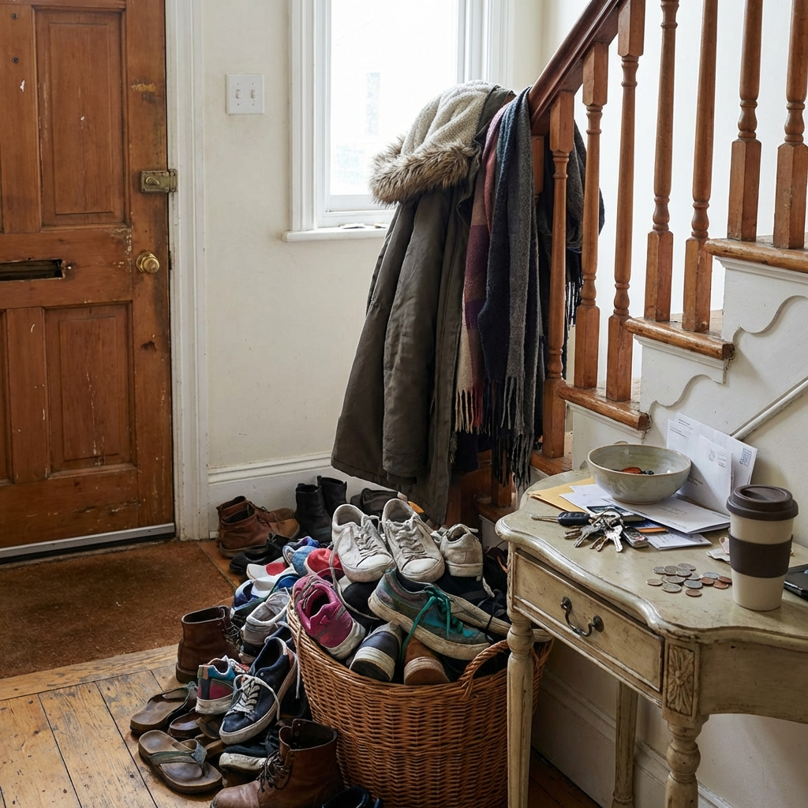
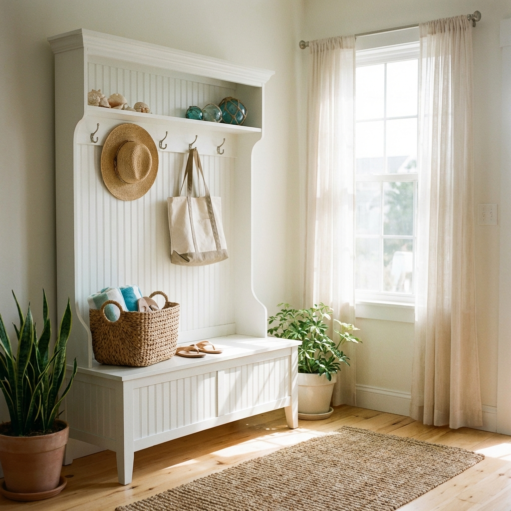

# Why Every Home Needs a Mudroom Locker System (Even If You Don't Have a Mudroom)

The sound of a key turning in a lock should be the precipitating note of a symphony of relaxation. It marks the boundary between the public sphere—with its demands, traffic, and noise—and the private sanctuary of the home. That moment, the crossing of the threshold, is a psychological shift as much as a physical one. It is the "exhale."

Or at least, it should be.

For far too many of us, the exhale is immediately choked off by a visual assault. Instead of a sanctuary, we step into a minefield. A backpack slouched sullenly against the baseboard; a solitary sneaker lying on its side, separated from its mate by a trail of mail; a coat draped over a banister like a weary ghost. This is the "Drop Zone" phenomenon, a chaotic byproduct of modern living where the transition from outside to inside becomes a clutter bottleneck.

For years, architectural magazines and home renovation shows have sold us a specific cure for this ailment: the Mudroom. We drool over sprawling, tiled antechambers with custom millwork, individual cubbies for every family member, and a dedicated dog-washing station. It is a beautiful dream. But for those of us living in urban apartments, vintage colonials, or standard suburban layouts that prioritize living space over utility rooms, the dedicated mudroom is an architectural fiction.

Here is the truth that the renovation industry doesn't want to tell you: You do not need a mudroom to have the function of a mudroom. You do not need to knock down walls or reroute plumbing. You need to stop thinking about the mudroom as a room, and start thinking about it as a system. Specifically, the locker system.

By integrating a hall tree or a standalone locker unit into your entryway, hallway, or even a sliver of garage space, you reclaim the threshold. You impose order on the chaos. This isn't just about buying furniture; it is about reclaiming the peace of that first exhale when you walk through the door.

The Psychology of the Threshold

To understand why a locker system is transformative, we have to understand the psychology of "liminal spaces." In architecture and anthropology, a liminal space is a place of transition. The entryway is the most important liminal space in your life. It is where you shed the armor of the day.

When we walk inside, our brains are programmed to switch modes. We naturally want to unburden ourselves—physically and mentally. We drop the heavy bag. We kick off the tight shoes. We toss the keys. This is a primal instinct to shed weight. When there is no designated "receiving" vessel for these items, they land where they fall. This creates "visual noise."

Neuroscience suggests that clutter competes for your attention in the same way a toddler or a nagging email does. Walking into a messy entryway spikes cortisol levels immediately. You haven't even taken your coat off, and your home is already yelling at you to clean up.

A vertical locker system or hall tree acts as an interception point. It creates a ritual. Instead of the "drop," you have the "hang." Instead of the "kick off," you have the "tuck away." It capitalizes on the vertical plane, which is often dead space in a home, to organize the horizontal plane, which is where we live.

Even if your "foyer" is a 4x4 square of hardwood directly in your living room, a locker system creates a phantom wall. It defines the space. It says, “This is where the outside stops, and the inside begins.”

The Anatomy of the Solution

When we talk about bringing a "locker system" into a home without a mudroom, we aren't suggesting industrial steel cages reminiscent of high school gymnasiums (unless that is your specific industrial-chic vibe). We are talking about the furniture category generally known as the "Hall Tree," but evolved.

A proper system needs three distinct zones to function effectively:
1.  The Crown (Hooks/Shelves): For coats, hats, scarves, and bags. This keeps fabrics off the floor and allows them to air out.
2.  The Bench (The Landing Pad): A place to sit while removing shoes is not a luxury; it is an ergonomic necessity that prevents people from tracking dirt further into the house.
3.  The Base (The Cubby): Shoe storage that is immediate and accessible. If you have to open a closet door to put your shoes away, you won't do it. Open cubbies are the secret to compliance.

Let’s explore three distinct architectural approaches to this system, analyzing how they function in real-world homes that lack dedicated utility square footage.

The Farmhouse Architect: Integrating Warmth and Utility

For many, the hesitation in buying a large storage unit is the fear that it will look sterile or bulky. If your home leans towards traditional, cottage, or farmhouse aesthetics, you need a piece that feels like heirloom furniture rather than a storage depot.

This brings us to the Bush Furniture Salinas Hall Tree with Storage Bench.

The Salinas collection is fascinating because it manages to tread the line between "robust storage" and "delicate design." It draws heavily from Mission-style architecture—note the tapered legs and the curved base rails. It doesn't look like a box; it looks like a deliberate design choice.

In a home without a mudroom, this piece acts as an anchor. The aesthetic details—particularly the wood grain finishes like Antique White or Vintage Black—allow it to sit comfortably in a living room or a visible hallway without screaming "utility closet."

Functionally, it creates a wide capture net. The bench is substantial, supporting up to 250 pounds, which means it isn’t just for show; you can actually sit on it to wrestle a toddler into their rainboots. The hook system is double-pronged, doubling the capacity for coats and bags. But the brilliance is in the upper storage. The open shelving at the top allows for baskets (not included, but highly recommended) where you can hide the true ugly clutter: winter gloves, dog leashes, and charging cables.

It turns a blank wall into a functional mudroom, but visually, it reads as a handsome bookcase or hutch.

Bush Furniture Salinas Hall Tree with Storage Bench
<a href="https://www.amazon.com/dp/B07_REPLACE_ASIN/?tag=marathonnewcastle-20" class="btn-primary">View on Amazon</a>

The Coastal Narrative: Texture and Breeze

Perhaps your home requires a lighter touch. In smaller spaces, or homes with a coastal or cottage narrative, heavy wood grain can sometimes feel oppressive. You want the storage, but you want it to feel airy. You want the piece to recede into the room, not dominate it.

Enter the Crosley Furniture Seaside Hall Tree.

There is a romance to this piece. It evokes the feeling of a beach house entry, even if you are landlocked in the Midwest. The defining feature here is the beadboard paneling on the back. Beadboard is a classic architectural texture that adds depth and shadow without adding bulk. It reflects light differently than a flat panel, giving the impression of craftsmanship and lightness.

The Crosley model is particularly adept for tighter entryways. Its footprint feels slightly more vertical and contained. The distressed finish options—whites, greys, and navys—are designed to hide the wear and tear of daily life. A scuff on a pristine black modern unit looks like damage; a scuff on a distressed coastal unit looks like "patina."

The drawer at the bottom of the Seaside Hall Tree is a distinct deviation from the open cubby system. This is a crucial distinction. While open cubbies are great for shoes you wear daily, a drawer is a "sanity saver." It is the place to throw the things that have no home—the stray umbrella, the reusable shopping bags, the flashlight. It allows you to sweep the visual noise completely out of sight.

For a home lacking a foyer, placing this near the door creates a "vignette." It invites you to hang a straw hat or a canvas tote, turning your storage into a styling opportunity.

Crosley Furniture Seaside Hall Tree
<a href="https://www.amazon.com/dp/B07_REPLACE_ASIN/?tag=marathonnewcastle-20" class="btn-primary">View on Amazon</a>

The Modern Workhorse: Volume and Efficiency

Let us be honest: sometimes, aesthetics must take a backseat to sheer, unadulterated volume. If you have three kids, two dogs, and a partner who plays recreational hockey, a delicate farmhouse bench isn't going to cut it. You need a machine. You need maximum cubic footage of storage per square inch of floor space.

The Prepac Wide Hall Tree with Shoe Storage is that machine.

This is the system for the pragmatist. It eschews decorative flourishes—no tapered legs, no beadboard, no distressed paint—in favor of clean, modern lines and aggressive utility. It is designed to merge seamlessly with modern drywall; it wants to look like a built-in.

The "Killer App" of the Prepac unit is the shoe storage. Most hall trees offer a cavernous space under the bench where shoes pile up in a jumble. Prepac divides the base into individual cubbies. This is a game-changer for organization. It forces a "one pair, one slot" discipline. It prevents the mountain of sneakers.

Furthermore, the width of this unit allows for a segmentation of space. You can mentally assign a "vertical slice" of the unit to each family member. The left hooks and cubbies are for the eldest; the right are for the youngest. It mimics the school locker environment, which is effective because it instills personal responsibility. "Put your bag in your spot" is an easier instruction to follow than "Put your bag away."

Constructed from laminated composite woods, it is wipeable, durable, and ready for the abuse of a busy household. It transforms a garage wall or a wide hallway into a high-functioning command center.

Prepac Wide Hall Tree with Shoe Storage
<a href="https://www.amazon.com/dp/B07_REPLACE_ASIN/?tag=marathonnewcastle-20" class="btn-primary">View on Amazon</a>

The Art of Implementation: Making it Work

Buying the unit is only step one. Integrating a locker system into a non-mudroom home requires a bit of strategic thinking. You are essentially grafting a new organ onto the body of your house. To ensure the transplant is successful, consider the following implementation strategies.

1. The "Zoning" of the Hallway
If you are placing these units in a hallway, you must ensure you maintain clear passage. A standard hallway is 36 to 48 inches wide. These units are typically 16 to 18 inches deep. Before you buy, tape out the footprint on the floor with painter's tape. Walk past it carrying a grocery bag. If you have to turn sideways, the unit is too deep. In that case, look for the Crosley or similar "slim" profiles, or consider moving the unit just around the corner into the living space.

2. The Basket Equation
The upper shelves of units like the Bush Salinas are beautiful, but if you fill them with loose winter hats and scarves, they will look messy. The secret to the "Pinterest-worthy" look is containment. Buy matching baskets—wicker, wire, or felt—that fit the cubbies perfectly.
   Wicker/Rattan: Adds warmth and texture (Great for the Crosley or Bush units).
   Wire/Canvas: Adds an industrial or modern touch (Great for the Prepac).
Label the baskets. One for "Winter Gear," one for "Sunblock/Bug Spray," one for "Returns/Errands." This turns the upper shelf into active storage.

3. The Seasonal Rotation
A hall tree is not a closet. It cannot hold everything you own. If you try to hang every coat you own on the Prepac, the hooks will fail or the unit will topple (and it will look terrible).
Adopt a "Season + 1" rule. The unit should hold the coats for the current season, plus perhaps one light rain jacket. When winter ends, the heavy parkas must migrate to a bedroom closet, and the denim jackets and windbreakers take their place. This rotation keeps the unit looking curated rather than stuffed.

4. The Anchor is Non-Negotiable
We touched on this, but it bears repeating: You must anchor these units to the wall. They are tall and heavy, and when you load the front with coats and have a human sit on the bench, the center of gravity shifts. All three units mentioned—Bush, Crosley, and Prepac—come with tipping restraint hardware. Use it. If you have baseboards that prevent the unit from sitting flush against the wall, shims and longer screws into the studs are your friends. This makes the unit feel like part of the architecture, not a wobbly bookshelf.

Conclusion: Reclaiming the Sanctuary

There is a profound peace in knowing where things go. When you install a locker system in a home that lacks a mudroom, you are doing more than buying a piece of furniture. You are building a buffer zone.

You are creating a space that catches the debris of the outside world so that your living room remains a place of rest. You are teaching your children (and reminding yourself) that everything has a home. You are transforming the frantic search for keys and the tripping over boots into a smooth, streamlined ritual of departure and arrival.

Whether you choose the warm, mission-style embrace of the Bush Salinas, the breezy, textured charm of the Crosley Seaside, or the regimented, modern efficiency of the Prepac Wide, the result is the same: A home that breathes easier.

You don't need a renovation crew to build a mudroom. You just need the right system to welcome you home.

Expert FAQ: Mudroom Locker Systems

Q: Can I place these hall trees in a garage if it’s not climate-controlled?
A: This is a common strategy, but proceed with caution. The Bush and Crosley units often use MDF or particle board components with veneers. In high-humidity environments or areas with extreme temperature swings, these materials can swell or warp over time. The Prepac unit, with its laminated composite, is generally hardier, but moisture is the enemy of all composite wood. If your garage is dry, it’s fine. If it gets damp, elevate the unit on rubber feet and ensure it's not touching a concrete floor that wicks moisture.

Q: My entryway is carpeted. Will these units be stable?
A: Carpet presents a tipping hazard because the unit will likely settle unevenly, usually leaning forward away from the wall tack strip. You must use the wall anchor. Additionally, you might need to use shims under the front legs (or base) to level the unit before anchoring it to the studs. A stable base is crucial for the bench to feel secure when you sit.

Q: How do I prevent the "locker room smell" if I keep shoes in the open cubbies?
A: Open cubbies actually help dissipate odors better than closed cabinets, but they don't eliminate them. Two pro tips: First, use charcoal deodorizer bags in the back of each cubby. Second, adopt a "dry-first" policy. If shoes are wet or muddy, they stay on a rubber mat by the door until dry, then they go into the cubby. Never put damp shoes into a wood composite cubby.

Q: Can I paint these units to match my wall color for a "built-in" look?
A: The Crosley and Bush units often have textured or finished surfaces that can be tricky to paint without proper prep (sanding and high-adhesion primer). The Prepac is laminate, which is notoriously difficult to paint as paint doesn't bond well to plasticized surfaces. If you want a built-in color, it is better to buy the unit in a neutral tone (white or black) and paint the wall behind it a contrasting color to make it pop, or add trim molding around the unit to integrate it.

Q: The weight limits on the hooks seem low. Can they hold heavy backpacks?
A: Standard hooks are usually rated for 5-10 lbs. A high schooler’s backpack can easily weigh 20 lbs. Do not hang heavy backpacks on the hooks provided. Instead, encourage placing backpacks on the bench or floor. If you must hang them, consider replacing the stock hooks with heavy-duty hardware and ensuring the back panel of the unit is anchored into a wall stud, not just the back of the furniture.

Q: How do I clean the beadboard or crevices in the Bush and Crosley units?
A: Dust loves texture. The beadboard on the Crosley and the detailing on the Bush will collect dust. Use a vacuum with a soft brush attachment for the crevices. Avoid soaking wet cloths, which can damage the seams of the veneer. A microfiber cloth with a light wood cleaner is your best bet for maintenance.

Q: Can I combine two of these units side-by-side?
A: Absolutely. This is a designer trick to create a "grand" mudroom look. Two Prepac or Bush units side-by-side can cover a large wall. If you do this, clamp the units together and screw them to each other (through the side panels) as well as to the wall. This eliminates the gap between them and makes them look like one massive, custom piece of millwork.

