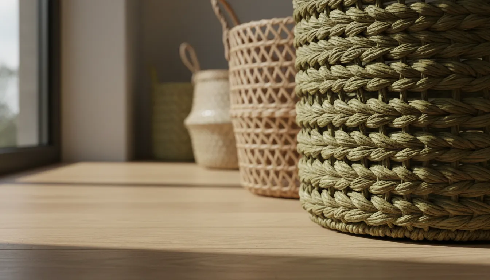
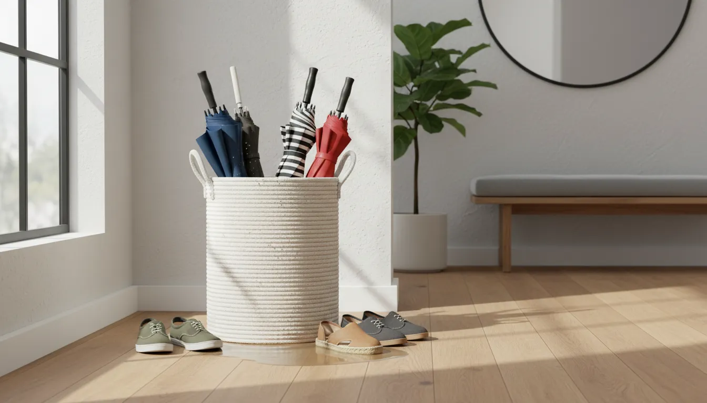
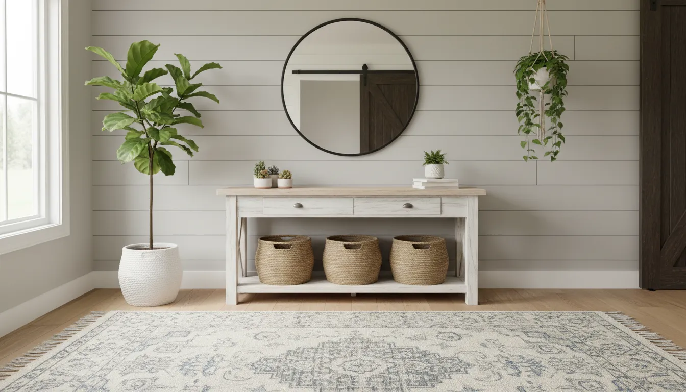

# Woven Basket Shoe Storage: Stylish Entryway Solutions for Casual Homes

The entryway is the handshake of the home—an introduction to your personal style and a transition point between the bustling outside world and your private sanctuary. However, without a dedicated system, this critical space often devolves into a chaotic dumping ground for footwear. Sneakers kick about near the door, boots topple over in corners, and sandals seem to multiply on the mat. The challenge lies not just in containing the clutter, but in doing so in a way that feels intentional and aesthetically pleasing.

For the casual, comfortable home, rigid plastic bins or industrial metal racks can feel too sterile or utilitarian. Enter the woven basket. Merging organic textures with practical durability, woven basket shoe storage offers a solution that hides the mess while elevating the design of your foyer. Whether your interior leans toward Coastal, Bohemian, Farmhouse, or Scandinavian Minimalist, incorporating natural fibers into your organization strategy adds warmth and character.

In this comprehensive guide, we will explore why woven baskets are the superior choice for casual entryways, how to select the right materials for longevity, and layout strategies to maximize space without sacrificing style.

## The Aesthetic Appeal of Natural Textures

In modern interior design, texture is as important as color. A room filled with flat, smooth surfaces can feel cold and uninviting. Woven baskets introduce a layer of tactile complexity that instantly softens a space. The intricate weaves of seagrass, rattan, or water hyacinth catch the light differently than solid wood or plastic, adding visual depth to the lower half of your room.

Using baskets for [shoe storage](/posts/entryway-shoe-organization-ideas) allows you to "hide in plain sight." Unlike clear containers that expose the visual noise of mismatched footwear, a basket provides a uniform façade. When lined up beneath a console table or a bench, they create a rhythm of repetition that is pleasing to the eye and suggests a curated, orderly home environment.

### Breathability and Shoe Health
Beyond aesthetics, the very nature of woven material offers a functional advantage specific to footwear: air circulation. Shoes require ventilation to dry out moisture from perspiration or weather elements. Enclosing shoes in airtight plastic containers can trap humidity, leading to mold growth, material degradation, and unpleasant odors.

Woven baskets possess natural gaps within the weave, allowing air to flow freely around the contents. This passive ventilation system helps keep footwear fresher and extends the lifespan of your favorite leather boots and canvas sneakers.

## Choosing the Right Material for Durability

Not all baskets are created equal, especially when they are destined for the heavy-duty task of holding shoes. The entryway is a high-traffic zone, and storage containers here will be pulled, pushed, and filled with heavy items daily. Selecting the right fiber is paramount for longevity.

### 1. Water Hyacinth
Water hyacinth baskets are characterized by their thick, chunky braids. They offer a lush, substantial look that works beautifully in farmhouse or rustic settings. The material is soft to the touch but rigid enough to hold its shape.
*   **Pros:** Highly decorative, soft texture preventing scratches on wood floors.
*   **Cons:** Can be susceptible to mold in very humid climates if damp shoes are thrown in directly.

### 2. Seagrass
Seagrass is often woven into a tighter, flatter pattern. It is naturally somewhat water-resistant and incredibly durable. Seagrass baskets often come with a wire frame, providing the structural integrity needed to hold heavier shoes like hiking boots.
*   **Pros:** excellent durability, resists staining, usually less expensive.
*   **Cons:** The texture can be rougher; ensure the bottom is smooth or use felt pads if sliding on delicate flooring.

### 3. Rattan and Wicker
Rattan is a vine-like species of palm that is exceptionally strong. Wicker refers to the technique of weaving, often using rattan, willow, or bamboo. These baskets offer a classic, timeless look and often feature sturdy handles.
*   **Pros:** extremely strong, rigid structure, classic aesthetic.
*   **Cons:** can be brittle if dried out over decades; rigid structure means less flexibility for overstuffing.

### 4. Cotton Rope
For a softer approach, coiled cotton rope baskets have become increasingly popular. While not "woven" in the traditional sense of hard fibers, they offer a casual, nautical aesthetic perfect for coastal homes.
*   **Pros:** Machine washable (often), soft edges safe for children, flexible.
*   **Cons:** Lack of rigidity can make them slouch if not filled; harder to keep upright on high shelves.

## Implementation Strategies: Layouts that Work

Once you have selected your material, the next step is integrating these baskets into your entryway layout. The goal is to maximize floor space while ensuring the storage is easily accessible. If it is difficult to put the shoes away, the pile by the door will return.

### The Bench and Cubby System
The most popular configuration for casual homes is the entryway bench with open cubbies underneath. This serves a dual purpose: it provides a place to sit while putting on shoes and designates a specific "parking spot" for footwear.

By measuring the cubbies precisely, you can find square or rectangular baskets that slide in like drawers. This creates a built-in look without the expense of custom cabinetry. It keeps the floor clear and allows you to categorize shoes by family member or type.

For those looking to implement this system, standard cube baskets are often the best fit. 

*   **Recommended Product:** [Set of Woven Cube Storage Baskets](https://www.amazon.com/s?k=woven+cube+storage+baskets&tag=hats0f8-20)

### The Open Console Approach
If your entryway features a console table, the empty space beneath it is prime real estate for storage. Placing two or three large, substantial baskets under the table creates a grounded look. This is an excellent solution for "overflow" shoes or for guests. It signals where shoes should go without needing a sign.

For this application, round or oval baskets often look softer and more inviting than rigid rectangles. Ensure the baskets are tall enough to conceal the shoes but low enough to fit comfortably under the table apron.

### Vertical Shelving Units
In narrow hallways where floor space is at a premium, verticality is your friend. a tall, open bookcase or ladder shelf can be transformed into a shoe rack by placing baskets on each shelf. This draws the eye upward and allows for significantly more storage volume in a small footprint.

Place heavier shoes (boots, work shoes) in baskets on the bottom shelves and lighter items (sandals, slippers, flip-flops) in baskets on the higher shelves. This maintains physical balance and visual harmony.

## Categorization and Organization Techniques

Buying the baskets is only half the battle; organizing the contents is what ensures long-term success. "The Basket" can easily become a black hole where single sneakers go to disappear if not managed correctly.

### Assigning Baskets by Person
In a multi-person household, the most effective method is assigning a specific basket to each individual. This promotes accountability. When Mom’s basket is full, she knows she needs to take a pair to the bedroom closet before adding a new pair to the entryway.

### Separation by Season
Unless you have an expansive mudroom, it is unlikely you can store every pair of shoes you own at the front door. Adopt a seasonal rotation system.
*   **Summer:** Baskets hold sandals, slides, and light sneakers. Heavy boots are moved to deep storage or a bedroom closet.
*   **Winter:** Baskets hold snow boots, rain boots, and heavy shoes. Flip-flops are retired for the season.

### Labeling for Clarity
To maintain the casual aesthetic, avoid plastic label makers. Instead, use natural materials for labeling. Small wooden tags tied to the basket handle with twine, or small chalkboard clips, allow you to identify the contents (e.g., "Dad," "Running," "Guests") without disrupting the organic vibe.

## Dealing with "The Dump Zone"

Realistically, children (and tired adults) may not always align shoes perfectly inside a basket. For families, the "toss" method is often the only realistic expectation.

Large, round, open-top baskets act as excellent catch-alls. These are particularly useful for items that don't stack well, such as flip-flops or kids' crocs. A large floor basket specifically for "garden shoes" or "quick trip" slides can keep the primary storage areas neat.

If you are dealing with a high volume of shoes in a tight corner, a tall, slender hamper-style basket can serve as a vertical shoe bin.

*   **Recommended Product:** [Tall Slim Woven Storage Basket](https://www.amazon.com/s?k=tall+slim+woven+basket&tag=hats0f8-20)

## Protecting Your Investment

Woven baskets are durable, but they are organic materials that can degrade if treated poorly. To ensure your entryway solution lasts for years, consider these maintenance tips.

### Liners are Essential
The interior of a woven basket can be snagged by buckles, zippers, or velcro. Conversely, dirt and mud from shoe soles can embed themselves in the weave, becoming difficult to clean.

Using a fabric liner solves both problems. Many baskets come with removable canvas liners. If yours do not, you can easily DIY a liner using drop cloth fabric or heavy linen. The liner can be removed and thrown in the washing machine whenever it gets dirty, keeping the basket itself pristine.

### Managing Moisture and Odors
Never put soaking wet shoes directly into a woven basket. The moisture can lead to mildew on the seagrass or rattan, which causes the fibers to rot and smell. Always allow wet boots to dry on a waterproof mat or boot tray before placing them in the basket.

To combat general shoe odors, place a small sachet of baking soda or cedar chips at the bottom of the basket (under the liner). Cedar naturally repels insects and absorbs moisture while providing a fresh, woodsy scent.

## Styling the Casual Entryway

Your shoe storage should integrate seamlessly with the rest of your decor. The goal is for the baskets to look like a deliberate design choice, not just a necessity.

### Mixing Textures
If you have a wicker basket, avoid pairing it with identical wicker furniture, which can look dated. Instead, contrast the rough weave of the basket with smoother textures. A velvet bench cushion, a sleek metal mirror, or a ceramic vase creates a dynamic interplay of surfaces.

### Color Coordination
Natural baskets come in a range of hues, from the pale blonde of birch to the deep honey of rattan and the dark browns of stained wicker. Choose a tone that complements your flooring.
*   **Dark Floors:** Opt for lighter seagrass or water hyacinth for contrast.
*   **Light Floors:** Darker stained rattan or banana leaf baskets ground the space.

### Greenery
Plants are the perfect companion to woven storage. The vibrant green of a snake plant or a fiddle leaf fig highlights the golden tones of the baskets, reinforcing the biophilic, nature-inspired theme of the entryway.

## Specific Solutions for Small Apartments

In studio apartments or homes with no defined foyer, space is the ultimate luxury. Here, woven baskets can be wall-mounted. Sturdy, flat-backed baskets hung on hooks can hold lightweight shoes like flats and sandals off the floor entirely. This clears the walkway and turns your storage into a wall installation.

Alternatively, look for "under-bed" style woven storage boxes that have a lower profile. These can sometimes slide under low-clearance sofas or cabinets near the door, utilizing dead space effectively.

For those needing significant capacity without a built-in look, large, handled market baskets are a great option. They are portable, allowing you to move the "mess" out of sight when guests arrive, and their handles make them easy to clean around.

*   **Recommended Product:** [Large Seagrass Storage Baskets with Handles](https://www.amazon.com/s?k=large+seagrass+storage+baskets+with+handles&tag=hats0f8-20)

## Conclusion

The transition from the outdoors to the indoors sets the tone for your entire living experience. A cluttered entryway creates immediate visual stress, while an organized one offers a breath of relief the moment you walk through the door.

Woven basket shoe storage offers the perfect marriage of form and function for casual homes. It respects the need for utility—hiding the pile of daily footwear—while embracing a relaxed, organic aesthetic. By choosing the right materials, implementing a smart layout, and maintaining your system, you can transform your entryway from a chaotic drop zone into a stylish, welcoming introduction to your home.

Whether you opt for a structured bench system with seagrass cubes or a laid-back collection of cotton rope coils, the result is the same: a cleaner home, a sharper design, and a place for everything.

### Frequently Asked Questions

**Can I paint woven baskets to match my decor?**
Yes, most natural fiber baskets can be spray painted. However, for a more professional and durable finish, consider "dipping" them. Tape off the top half and paint only the bottom third. This maintains the natural texture while adding a splash of color.

**How do I clean dust from the weave?**
The vacuum cleaner is your best tool. Use the brush attachment to gently suction dust out of the crevices of the weave. for tighter spots, a can of compressed air (used for keyboards) works wonders.

**Are woven baskets sturdy enough for heavy work boots?**
Standard open-weave baskets may sag over time with heavy boots. Look for baskets constructed with a metal wire frame or a wooden base reinforcement for heavy-duty storage needs.

**Where else can I use these baskets if I change my system?**
That is the beauty of woven storage. If you eventually buy a closed shoe cabinet, these baskets can be repurposed for [blanket storage](/posts/living-room-blanket-storage-ideas), toy organization, pantry goods, or bathroom towel holders. They are universally useful throughout the home.